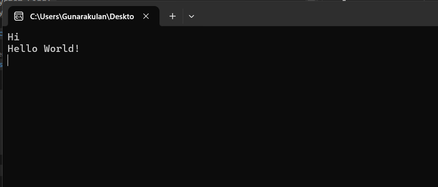

# Basic Snippets Code

## 0-helloword Example

### Program.cs

```c#

using System;
using System.Collections.Generic;
using System.Linq;
using System.Text;

namespace HelloWorld
{
    class Program
    {
        static void Main(string[] args)
        {
            // This is a comment.
            Console.WriteLine("Hi");
            Console.WriteLine("Hello World!");
            Console.ReadLine();

        }

    }
}


```

### Ouput




## 1-variable Example

### Program.cs


```c#

using System;
using System.Collections.Generic;
using System.Linq;
using System.Text;

namespace Variables
{
    class Program
    {
        static void Main(string[] args)
        {
            /*
            int x;
            int y;

            x = 7;
            y = x + 3;
            Console.WriteLine(y);
             */
            //string myfirstname;
            //string myFirstName;
            //myFirstName = "Bob";

            //string myFirstName = "Bob";

            //var myFirstName = "Bob";

            //Console.WriteLine(myFirstName);


            int x = 7;
            string y = "5";
            string myFirstTry = x.ToString() + y;
            int mySecondTry = x + int.Parse(y);
            Console.WriteLine(myFirstTry);
            Console.WriteLine(mySecondTry);

            Console.ReadLine();


        }
    }
}


```


### Ouput

