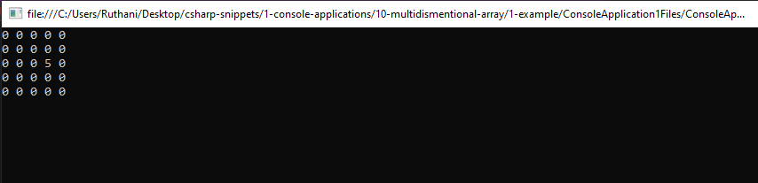
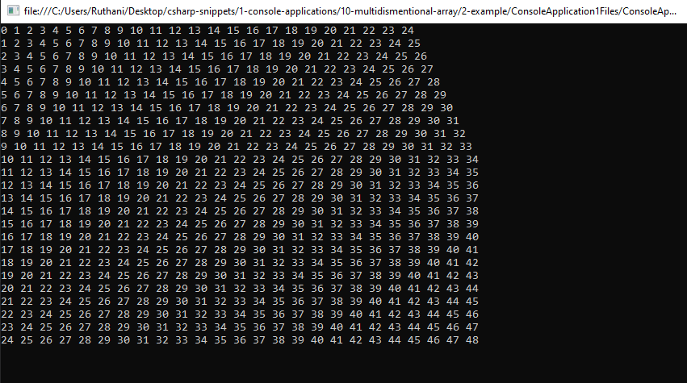

# multidismentional Snippets Code

## 1- Example

### Program.cs

```c#
using System;
using System.Collections.Generic;
using System.Linq;
using System.Text;
using System.Threading.Tasks;

namespace ConsoleApplication1
{
    class Program
    {
        public static void Main(string[] args)
        {

            createGrid();
            Console.ReadKey();
        }

        public static void createGrid() {

            int width = 5;
            int height = 5;

            int[,] grid = new int[width, height];

            grid[2, 3] = 5;

            for (int a = 0; a < width; a++) {

                for (int b = 0; b < height; b++) {

                    Console.Write(grid[a,b]+" ");

                }
                Console.WriteLine();
               
            }

            

        }


    }
}

```

### Ouput




## 2 Example

### Program.cs


```c#
using System;
using System.Collections.Generic;
using System.Linq;
using System.Text;
using System.Threading.Tasks;

namespace ConsoleApplication1
{
    class Program
    {
        public static void Main(string[] args)
        {

            createGrid();
            Console.ReadKey();
        }

        public static void createGrid() {

            int width = 25;
            int height = 25;

            int[,] grid = new int[width, height];

            grid[2, 3] = 5;

            for (int a = 0; a < width; a++) {

                for (int b = 0; b < height; b++) {

                    grid[a, b] = a + b;

                    Console.Write(grid[a,b]+" ");


                }
                Console.WriteLine();
               

            }
            

        }


    }
}


```

### Ouput


