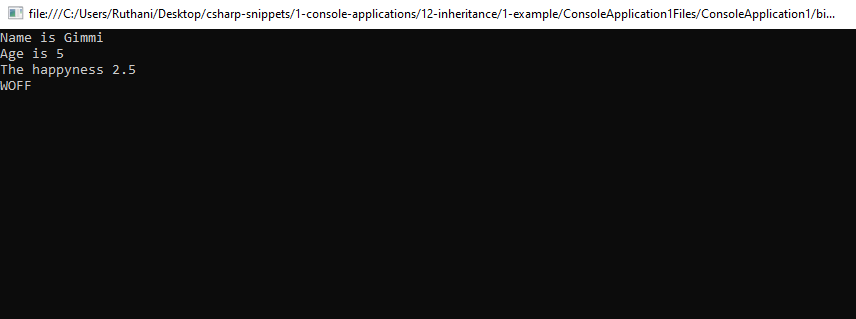
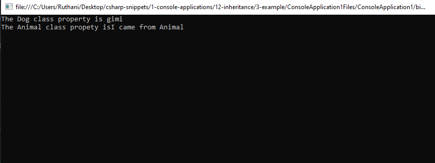

# inheritance Snippets Code

## 1- Example

### Program.cs

```c#
using System;
using System.Collections.Generic;
using System.Linq;
using System.Text;
using System.Threading.Tasks;

namespace ConsoleApplication1
{
    class Program
    {
        class Animal {//main blueprint Class.

           public string name;
           public int age;
           public float happyness;


            public void printBase() {

                Console.WriteLine("Name is " + name);
                Console.WriteLine("Age is " + age);
                Console.WriteLine("The happyness " + happyness);

            }

        }

        class Dog : Animal {//Dog is derived from Animal class.

           public int spotCount;

            public void printDog() {

                Console.WriteLine("WOFF");

            }

        }

        class Cat : Animal {//Cat is derived from Animal class.

           public int cuteness;

            public void printCat() {

                Console.WriteLine("MEWO");

            }

        }

        public static void Main(string[] args)
        {
            Dog gmmi = new Dog();//Craeted an instance of Dog class.The Dog class is dervied from Aniaml
            gmmi.name = "Gimmi";
            gmmi.age = 5;
            gmmi.happyness = 2.5f;
            gmmi.spotCount = 15;

            gmmi.printBase();
            gmmi.printDog();
            Console.ReadKey();

            Cat hie = new Cat();//Created an instance of Cat Class.The Cat class is dervied from Animal.
            hie.name = "Hie";
            hie.age = 2;
            hie.happyness = 1.5f;
            hie.cuteness = 12;
            hie.printBase();
            hie.printCat();
            Console.ReadKey();

        }

    } 

}
//The whole idea behind the inheritance is Code reuse.
//The Animal is the base class (Blueprint).
//Dog and Cat are derived from Animal Class.
//We can access properties and methods from the Animal class inside Dog or Cat.
//But We can't access data from Dog insie Cat or Car inside Dog.

    
```

### Ouput




## 2 Example

### Program.cs


```c#
using System;
using System.Collections.Generic;
using System.Linq;
using System.Text;
using System.Threading.Tasks;

namespace ConsoleApplication1
{
    class Program
    {
        class Animal {//main blueprint Class.

           public string name;
           public int age;
           public float happyness;


            public void printBase() {

                Console.WriteLine("Name is " + name);
                Console.WriteLine("Age is " + age);
                Console.WriteLine("The happyness " + happyness);

            }

        }

        class Dog : Animal {//Dog is derived from Animal class.

           public int spotCount;

            public void printDog() {

                Console.WriteLine("WOFF");

            }

        }

        class Cat : Dog {//Cat is derived from Dog.Dog is already dervied from Animal.

           public int cuteness;

            public void printCat() {

                Console.WriteLine("MEWO");

            }

        }

        public static void Main(string[] args)
        {
           

            Cat hie = new Cat();//Created an instance of Cat Class.The Cat class is dervied Dog.The Dog is already part of the Animal. 
            hie.name = "Hie";   //so we can access Dog data through out the Cat.
            hie.age = 2;
            hie.happyness = 1.5f;
            hie.cuteness = 12;
            hie.printBase();
            hie.printCat();
            hie.printDog();//Dog method
            hie.spotCount = 5;//Dog property.
   
            Console.ReadKey();


        }

    } 

}

//The Cat instances are able to access the Dog's and the Animal's properties and methods.
//Because Dog is dervied from Animal.The Cat is dervied from Dog.
//Dog has Animal data alerady so the Cat is the instance of Dog.
//through out the Cat i can access dog and Animal data.because cat is dervied from Dog.Dog is dervied from Animal.
//in this case Animal is the blueprint.


```

### Ouput


## 3 Example

### Program.cs
```c#
using System;
using System.Collections.Generic;
using System.Linq;
using System.Text;
using System.Threading.Tasks;

namespace ConsoleApplication1
{
    class Program
    {
        class Animal {

            public string name="I came from Animal";
            
        }

        class Dog : Animal {//Dog is dervied from Animal.

            public string name;

            public void printDog() {

                Console.WriteLine("The Dog class property is "+name);//This is the Dog class name variable.
                Console.WriteLine("The Animal class propety is" + base.name);//This is the Animal class variable.
                
            }
            


        }
            

        public static void Main(string[] args)
        {

            Dog gmi = new Dog();
            gmi.name = "gimi";//value to Dog class.
            gmi.printDog();
            Console.ReadKey();
          

        }

    } 

}
//for some cases we need to have same name variable inside the dervied class.
//for that needs we can use base keyword to access the blueprint variable.


```
### Output


## 4 Example

### Program.cs
```c#
using System;
using System.Collections.Generic;
using System.Linq;
using System.Text;
using System.Threading.Tasks;

namespace ConsoleApplication1
{

    class StudentData {

        public string name;
        public int age;
        public string stream;

        public void printData() {

            Console.WriteLine("The name is " + name);
            Console.WriteLine("The age is " + age);
            Console.WriteLine("The Strem is " + stream);

        }

    }

    class ClassRoom : StudentData{

        public string nameOfClass;

        public void printClass() {

            Console.WriteLine(nameOfClass);
                
        }

    }

    class Program
    {
       

        public static void Main(string[] args)
        {

            ClassRoom kuna = new ClassRoom();
            kuna.name = "kuna";
            kuna.age = 21;
            kuna.stream = "Computer Sciecnce";
            kuna.printData();
            kuna.nameOfClass = "A level";
            kuna.printClass();

            Console.ReadKey();

        }

    } 

}
//another Example of inheritance.


```
### Output

