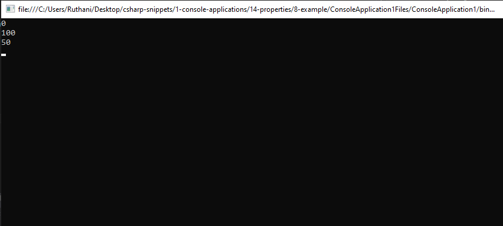

# properties Snippets Code

## 1- Example

### Program.cs

```c#
using System;
using System.Collections.Generic;
using System.Linq;
using System.Text;
using System.Threading.Tasks;

namespace ConsoleApplication1
{
    
    class Program
    {

        public static void Main(string[] args)
        {

            DateTime curTime = DateTime.Now;

            Console.WriteLine(curTime);
            Console.ReadKey();
                
        
        }

    } 

}
//DateTime class contains the time of the pc.

```

### Ouput


## 2- Example

### Program.cs


```c#
using System;
using System.Collections.Generic;
using System.Linq;
using System.Text;
using System.Threading.Tasks;

namespace ConsoleApplication1
{
    
    class Program
    {

        class Player {

           public int health = 100;


        }

        public static void Main(string[] args)
        {

            Player Tom = new Player();
            Console.WriteLine(Tom.health);//in this line health is 100;
            Tom.health = 40;//Here I have chagned the value to 40;
            Console.WriteLine(Tom.health);//This will print 40;
            Console.ReadKey();
                
                        
          
        
        }

    } 

}

```

### Ouput


## 3- Example

### Program.cs

```c#
using System;
using System.Collections.Generic;
using System.Linq;
using System.Text;
using System.Threading.Tasks;

namespace ConsoleApplication1
{
    
    class Program
    {

        class Player {

           public int health = 100;

        }

        public static void Main(string[] args)
        {
            Player tom = new Player();
            tom.health -= 40;
            Console.WriteLine(tom.health);
            Console.ReadKey();
            
        }

    } 

}

```
### Ouput


## 4- Example

### Program.cs

```c#
using System;
using System.Collections.Generic;
using System.Linq;
using System.Text;
using System.Threading.Tasks;

namespace ConsoleApplication1
{
    
    class Program
    {
        class Player {

           public int health = 100;

            public void damage(int _dam) {//This method takes an integer.

                health -= _dam;//decrese the parameter values from the health ammount.

            }

        }

        public static void Main(string[] args)
        {
            Player tom = new Player();//I have created a tom instance of Player().
            tom.damage(50);//I run the damage method and sent 50 as value.
            Console.WriteLine(tom.health);
            Console.ReadKey();
            
        }

    } 

}

```
### Ouput


## 5- Example

### Program.cs

```c#
using System;
using System.Collections.Generic;
using System.Linq;
using System.Text;
using System.Threading.Tasks;

namespace ConsoleApplication1
{
    
    class Program
    {

        class Player {

           private int _health = 100;

            public int health{//We use int becaste we're returning integer value.

                get {//health is public this can be accessed outside this class also.

                    return _health;//we are returning the private _health as public health.
                                   //so now _health value can be used as health value outside.
                }

            }           

        }

        public static void Main(string[] args)
        {

            Player tom = new Player();
            // tom.health -= 50; We can't do this becasue we have permisson to read only.
            Console.WriteLine(tom.health);
            Console.ReadKey();
                       
        }

    } 

}
//get returns the private _health as public health.
//we can only readonly but we cannot change it's value.

```
### Ouput


## 6- Example

### Program.cs

```c#
using System;
using System.Collections.Generic;
using System.Linq;
using System.Text;
using System.Threading.Tasks;

namespace ConsoleApplication1
{
    
    class Program
    {

        class Player {

           private int _health = 100;

            public int health//Why we use int is because we're returning the integer value.
            {
                get//This is the get only property.
                {
                    return _health;//This means whenever we try to get health it returns the _health ammount as health.
                                   // health is public. But _health is private we can use it inside only this class.
                                   
                }   
            }

            public void damage(int _dam) {

                _health -= _dam;

            }
        }

        public static void Main(string[] args)
        {
            Player tom = new Player();
            tom.damage(10);//we can damage tom.
            //tom.health=50; //we can't decrese the value like this.because we didn't specify the setter.
            Console.WriteLine(tom.health);
            Console.ReadKey();
           
                       
        }

    } 

}
//This is get readonly.

```
### Ouput


## 7- Example

### Program.cs

```c#
using System;
using System.Collections.Generic;
using System.Linq;
using System.Text;
using System.Threading.Tasks;

namespace ConsoleApplication1
{
    
    class Program
    {

        class Player {

           private int _health = 100;

            public int health{//We use int becaste we're returning integer value.

                get {//health is public this can be accessed outside this class also.

                    return _health;//we are returning the private _health as public health.
                                   //so now _health value can be used as health value outside.
                }
                set {//This is for setting purpose.

                    _health = value;//The value is the value that we pass from the instance.

                }

            }           

        }

        public static void Main(string[] args)
        {

            Player tom = new Player();
             tom.health -= 50;//Now it is posible.because i have given the set feature.The value in line 26 is the value we give here.
            Console.WriteLine(tom.health);
            Console.ReadKey();
                       
        }

    } 

}
//get returns the private _health as public health.
//we can use it readonly but we cannot change it's value.


```
### Output


## 8- Example

### Program.cs

```c#
using System;
using System.Collections.Generic;
using System.Linq;
using System.Text;
using System.Threading.Tasks;

namespace ConsoleApplication1
{
    
    class Program
    {

        class Player {

           private int _health = 100;//because we don't want to directly change this value.

            public int health{//We use int becaste we're returning integer value.

                get {//health is public this can be accessed outside this class also.

                    return _health;//we are returning the private _health as public health.
                                   //so now _health value can be used as health value outside.
                }
                set {//This is for setting purpose.

                    if (value <= 0)//if the value we're passing is less than or equal to 0 the _health would be 0;
                    {
                        _health = 0;
                    }
                    else if (value >= 100)//if the value is greather than or equal to 100 the _health would be 100.
                    {

                        _health = 100;

                    }
                    else {//Otherwise 1 to 99 will be applied.

                        _health = value;
                    }

                }

            }           

        }

        public static void Main(string[] args)
        {

             Player tom = new Player();
            tom.health = -200;//It is imposiable.It returns 0.
            Console.WriteLine(tom.health);
            tom.health = 5000;//it is not posible.It retuens 100.
            Console.WriteLine(tom.health);
            tom.health = 50;//this is posiable.
            Console.WriteLine(tom.health);
            Console.ReadKey();
                       
        }

    } 

}
//we have written an if statement in the set section.loot at that carefully.


```
### Output


