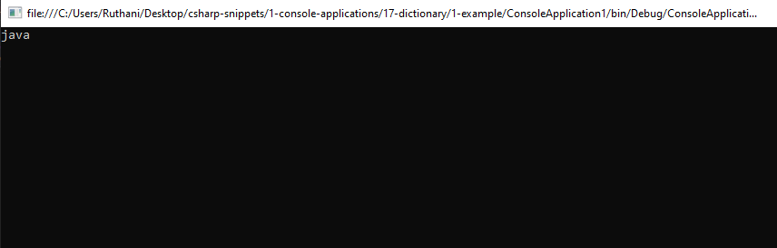

# dictionary Snippets Code

## 1- Example

### Program.cs

```c#
using System;
using System.Collections.Generic;
using System.Linq;
using System.Text;
using System.Threading.Tasks;

namespace ConsoleApplication1
{
    class Program
    {
        static void Main(string[] args)
        {

            Dictionary<string, string> books = new Dictionary<string, string>(5);
            books.Add("name1", "java");
            books.Add("name2", "C++");
            books.Add("name3", "php");

            Console.WriteLine(books["name1"]);
            Console.ReadKey();


        }
    }

}

//Dictionary are right equal to associative array.
//It is looks like list<> array.

```

### Ouput




## 2 Example

### Program.cs


```c#
using System;
using System.Collections.Generic;
using System.Linq;
using System.Text;
using System.Threading.Tasks;

namespace ConsoleApplication1
{
    class Program
    {
        static void Main(string[] args)
        {
            
            Console.WriteLine(Utlities.ComapareValues(1,1));//we can put string values or any data type instead of int.
            Console.ReadKey();

        }
    }

    class Utlities
    {

        public static bool ComapareValues<T01, T02>(T01 value1, T02 value2) {

            return value1.Equals(value2);
        }

    }

}

//we can use this code for comparition.
```

### Ouput


## 3 Example

### Program.cs
```c#
using System;
using System.Collections.Generic;
using System.Linq;
using System.Text;
using System.Threading.Tasks;

namespace ConsoleApplication1
{
    class Program
    {
        static void Main(string[] args)
        {
            
            Console.WriteLine(Utlities.ComapareValues(1,"kuna"));//This is comparing the type.
            Console.ReadKey();

        }
    }

    class Utlities
    {

        public static bool ComapareValues<T01, T02>(T01 value1, T02 value2) {

            return typeof(T01).Equals(typeof(T02));
        }

    }

}

//This is code checks the date type.

```
### Output


