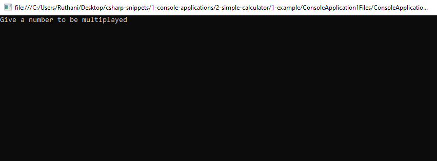
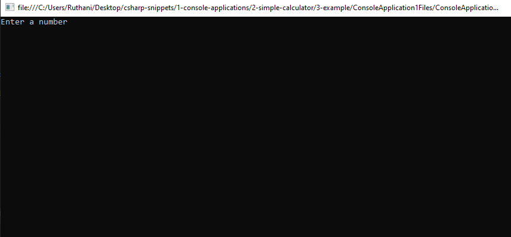

# simple-calculator Snippets Code

## 1- Example

### Program.cs

```c#

using System;
using System.Collections.Generic;
using System.Linq;
using System.Text;
using System.Threading.Tasks;

namespace ConsoleApplication1
{
    class Program
    {
       public static void Main(string[] args)
        {

            int num01;
            int num02;

            Console.Write("Give a number to be multiplayed");//write prints without line breack.
            num01 = Convert.ToInt32(Console.ReadLine());//ReadLine() is used to get user input form the console.
            Console.WriteLine("Give another number");
            num02 = Convert.ToInt32(Console.ReadLine());//Convert is mainly used for converting purpose at this case we convert the numbers to int32.
            Console.WriteLine("The Total is " + (num01 * num02));
            Console.ReadKey();

            //This is a simple program to multiplay two numbers together.
            //int is integer type variable.
            //float is decimalpoint number.
            //dobule is same as decimalpoint number.
            //bool is boolean type
            //string is for long string value and it is string type
            //char is for single one charactor.
            //we can also use the var keyword to define loosely typed variables.
            //arthimatic are + - * / %


        }
    }
}


```

### Ouput




## 2 Example

### Program.cs


```c#
using System;
using System.Collections.Generic;
using System.Linq;
using System.Text;
using System.Threading.Tasks;

namespace ConsoleApplication1
{
    class Program
    {
       public static void Main(string[] args)
        {
            start:
            int num1;
            int num2;

            Console.WriteLine("Enter a number");
            num1 = Convert.ToInt32(Console.ReadLine());
            Console.WriteLine("Enter another Number");
            num2 = Convert.ToInt32(Console.ReadLine());
            Console.WriteLine(num1+" is divited by "+num2+" is "+(num1/num2));
            Console.ReadKey();
            goto start;

            //same as the pervioues program but this program works in a loops.
            //that's why i put goto;
			//This program will work in an infinite loop.
            
        }
    }
}


```


### Ouput


## 3 Example

### Program.cs
```c#
using System;
using System.Collections.Generic;
using System.Linq;
using System.Text;
using System.Threading.Tasks;

namespace ConsoleApplication1
{
    class Program
    {
        public static void Main(string[] args)
        {

            double num1;
            double num2;

            Console.WriteLine("Enter a number");
            num1 = Convert.ToDouble(Console.ReadLine());
            Console.WriteLine("Enter another Number");
            num2 = Convert.ToDouble(Console.ReadLine());

            s:     //This will loop thorugh only the printing section.
            Console.WriteLine(num1 + " is added by " + num2 + " is " + (num1 + num2));
            Console.ReadKey();
            goto s;


            //This program can add decimal number.

        }
    }
}

```
### Output


