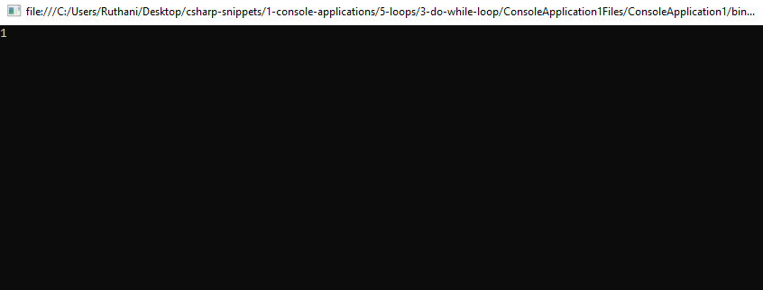

# 3-do-while-loop Snippets Code

## ConsoleApplication1 Example

### Program.cs

```c#
using System;
using System.Collections.Generic;
using System.Linq;
using System.Text;
using System.Threading.Tasks;

namespace ConsoleApplication1
{
    class Program
    {
        public static void Main(string[] args)
        {

            int a = 1;

            do
            {
                Console.WriteLine(a);
                a++;
				
            } while (a == 0);


            Console.ReadKey();

            //do while loop is same as other programming languages.
        }

    }
}

```

### Ouput




      


