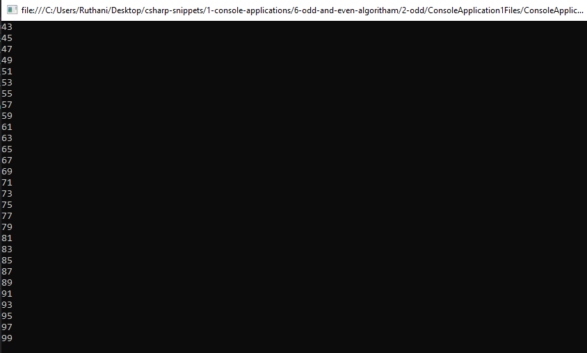

# 6-odd-add-even-algoritham Snippets Code

## 2-odd Example

### Program.cs

```c#
using System;
using System.Collections.Generic;
using System.Linq;
using System.Text;
using System.Threading.Tasks;

namespace ConsoleApplication1
{
    class Program
    {
        public static void Main(string[] args)
        {

            for (int a = 0; a <= 100; a++) {

                if (a % 2 == 0 == false) {

                    Console.WriteLine(a);

                }

                
            }

            Console.ReadKey();


            //this is will returns odd numbers.
          
        }

    }
}

     
```

### Ouput




      


