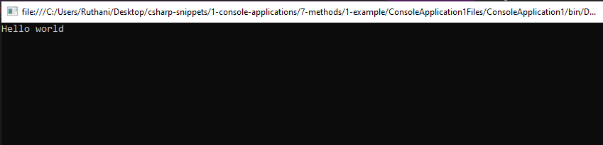
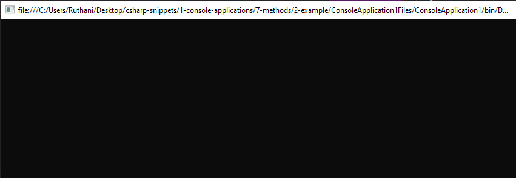
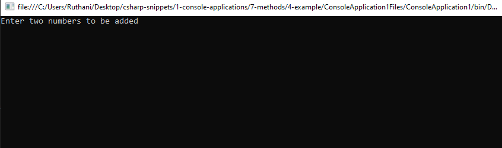
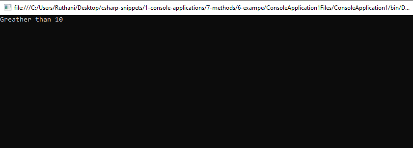

# methods Snippets Code

## 1- Example

### Program.cs

```c#
using System;
using System.Collections.Generic;
using System.Linq;
using System.Text;
using System.Threading.Tasks;

namespace ConsoleApplication1
{
    class Program
    {
        public static void Main(string[] args) //This is the main method.it exexutes when the program starts.
        {


            greetUser();//I called the method in main method becasue main method runs when the application starts.

        }

        public static void greetUser() {//this is a method which is created by me.

            Console.WriteLine("Hello world");//WriteLine() is a pre-defind method that it takes texts values as parameter's values.
            Console.ReadKey();//ReadKey() is also a pre-defind method in C#.

        }


    }
}
//method is same as functions in javascript and php.
//in javascript and php there are many pre-defind methods such as toString() fillter_var() like WriteLine() or ReadKey().
//Method has behaviors and actions or contains properties.
//It can take parameter's values like function.
//WriteLine() is a pre-defind method in C# it has it's own behaviors.
//Each methods in programming has tasks to complte like function in functional programming like JS and PHP.
//Like that our custom methods also can be written that the way we expect.


```

### Ouput




## 2- Example

### Program.cs


```c#
using System;
using System.Collections.Generic;
using System.Linq;
using System.Text;
using System.Threading.Tasks;

namespace ConsoleApplication1
{
    class Program
    {
        public static void Main(string[] args) //This is the main method.it exexutes when the program starts.
        {

          
            greatingUser(Console.ReadLine());

        }

        public static void greatingUser(string name) {

            Console.WriteLine(name);

             last();
        }

        public static void last() {

            Console.WriteLine("Programme has been finished");
            Console.ReadKey();

        }

        

    }
}
//This is a simple program i have called the last() method in the greatingUser which is the second method in the code above.
//greatingUser method is called when the program executes because it is in the main method.
//in functional programming we call functions in functions also we could call many functions in a single function.
//method is also same as that.

```


### Ouput



## 3- Example

### Program.cs

```c#
using System;
using System.Collections.Generic;
using System.Linq;
using System.Text;
using System.Threading.Tasks;

namespace ConsoleApplication1
{
    class Program
    {
        public static void Main(string[] args) //This is the main method.it exexutes when the program starts.
        {

            add(10, 65);
            

        }


        public static void add(int num1, int num2) {

            Console.WriteLine(num1 + num2);
            Console.ReadKey();

        }

 


    }
}

//This add method takes two parameter values num1 and num2.
//we sent the parameter values from the Main method.
//add method is added two number together and print out the result.

```
### Ouput


## 4- Example

### Program.cs

```c#
using System;
using System.Collections.Generic;
using System.Linq;
using System.Text;
using System.Threading.Tasks;

namespace ConsoleApplication1
{
    class Program
    {
        public static void Main(string[] args) //This is the main method.it exexutes when the program starts.
        {
            Console.WriteLine("Enter two numbers to be added");
            int userNum1 = Convert.ToInt32(Console.ReadLine());

            int userNum2 = Convert.ToInt32(Console.ReadLine());

            add(userNum1, userNum2);

        }


        public static void add(int num1, int num2) {

            Console.WriteLine("Total is "+(num1 + num2));
            Console.ReadKey();
        }

    }
}

//In the main method i get two user inputs and stored them in  variables.
//I called the add method with those values.

```
### Ouput



## 5- Example

### Program.cs

```c#
using System;
using System.Collections.Generic;
using System.Linq;
using System.Text;
using System.Threading.Tasks;

namespace ConsoleApplication1
{
    class Program
    {
        public static void Main(string[] args) //This is the main method.it exexutes when the program starts.
        {

            Console.WriteLine("Enter two numbers to be added");
            int num1 = Convert.ToInt32(Console.ReadLine());
            int num2 = Convert.ToInt32(Console.ReadLine());

            add(num1, num2);


        }


        public static void add(int num1, int num2) {

            int total = num1 + num2;

            if (total >= 10)
            {

                Console.WriteLine("The total is greather than 10");
            }
            else {

                Console.WriteLine("it is not greather than 10");
            }
            Console.ReadKey();


        }

        

    }
}


```
### Ouput


## 6- Example

### Program.cs

```c#
using System;
using System.Collections.Generic;
using System.Linq;
using System.Text;
using System.Threading.Tasks;

namespace ConsoleApplication1
{
    class Program
    {
        public static void Main(string[] args) //This is the main method.it exexutes when the program starts.
        {

            int result = add(10, 2);

            if (result >= 10)
            {

                Console.WriteLine("Greather than 10");
            }
            else {

                Console.WriteLine("Less than 10");
            }
            Console.ReadKey();

        }


        public static int add(int num1, int num2) {//this method returns the value back.

            return num1 + num2;


        }


    }
}
//you can notice we used int instead of void.
//void means executes the code in the method never returns back.
//but if we use int or other data types depanding on the programming purpose it returns the value back.

```
### Ouput



## 7- Example

### Program.cs

```c#
using System;
using System.Collections.Generic;
using System.Linq;
using System.Text;
using System.Threading.Tasks;

namespace ConsoleApplication1
{
    class Program
    {
        public static void Main(string[] args) //This is the main method.it exexutes when the program starts.
        {

            Console.WriteLine(name("kuna"));
            Console.ReadKey();

        }


        public static string name(string name) {

            return "hello "+name;

        }


    }
}

//in this case we use string because we are sending back string value.


```
