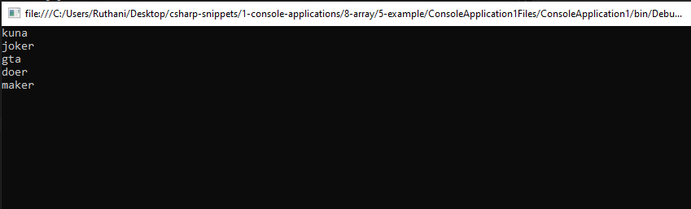
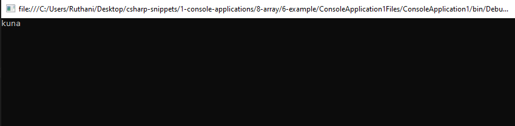

# array Snippets Code

## 1- Example

### Program.cs

```c#
using System;
using System.Collections.Generic;
using System.Linq;
using System.Text;
using System.Threading.Tasks;

namespace ConsoleApplication1
{
    class Program
    {
        public static void Main(string[] args) 
        {
            
            int[] numbers = new int[6]; //This is how we create array in C#.
            numbers[0] = 12;
            numbers[1] = 35;
            numbers[2] = 9;
            numbers[3] = 55;
            numbers[4] = 98;
            numbers[5] = 65;

            Console.WriteLine(numbers[5]);
            Console.ReadKey();
            
        }
        
    }
}

//In C# creating an array fully distinct from other programming languages such as javascript and php.
//if we want to make string arrays we should put 'string[] nameOfArr new string[length]'.
//like that for other data types of arrays.
//array index starts at 0 like others programming languages.
//We must specify the length of array in this [] brakets.

```

### Ouput


## 2- Example

### Program.cs


```c#
using System;
using System.Collections.Generic;
using System.Linq;
using System.Text;
using System.Threading.Tasks;

namespace ConsoleApplication1
{
    class Program
    {
        public static void Main(string[] args)
        {

            int numbersOFArr = 6;

            string[] names = new string[numbersOFArr];

            names[0] = "kuna";
            names[1] = "rakulan";
            names[2] = "joker";
            names[3] = "gta";
            names[4] = "maker";
            names[5] = "java";

            Console.WriteLine(names[5]);
            Console.ReadKey();


        }

    }
}

//This is the string type of array.
//we have created an integer called numbersofArr we have stroed 6 and we can use this in many array then we can programatically access.


```

### Ouput


## 3- Example

### Program.cs

```c#
using System;
using System.Collections.Generic;
using System.Linq;
using System.Text;
using System.Threading.Tasks;

namespace ConsoleApplication1
{
    class Program
    {
        public static void Main(string[] args)
        {


            string[] names = new string[6];

            names[0] = "kuna";
            names[1] = "rakulan";
            names[2] = "joker";
            names[3] = "gta";
            names[4] = "maker";
            names[5] = "java";

            for (int a = 0; a < names.Length; a++) {

                Console.WriteLine(names[a]);
               
            }

            Console.ReadKey();

        }
        
    }
}

//This is the string type of array.
//This looped thorgh a string array.
//.length is used to know the length of an array.
//in JS we also use the .length property but in php we use the count() method. 


```
### Ouput


## 4- Example

### Program.cs

```c#
using System;
using System.Collections.Generic;
using System.Linq;
using System.Text;
using System.Threading.Tasks;

namespace ConsoleApplication1
{
    class Program
    {
        public static void Main(string[] args)
        {
            int numArr = 10;

            float[] Dnums = new float[numArr];
            
            for(int r = 0; r < Dnums.Length; r++)//This loop assigned numbers to the entire array.
            {

                Dnums[r] = 95 + r;

            }

            for (int a = 0; a < Dnums.Length; a++) {//This array loop through the assigned array one by one.


                Console.WriteLine(Dnums[a]);
                Console.ReadKey(); 

            }


        }

    }
}

//This is the string type of array.
//we have created an integer called numbersofArr we have stroed 6 and we can use this in many array then we can programatically access.


```
### Ouput


## 5- Example

### Program.cs

```c#
using System;
using System.Collections.Generic;
using System.Linq;
using System.Text;
using System.Threading.Tasks;

namespace ConsoleApplication1
{
    class Program
    {
        public static void Main(string[] args)
        {

            string[] names = new string[5];

            names[0] = "kuna";
            names[1] = "joker";
            names[2] = "gta";
            names[3] = "doer";
            names[4] = "maker";

            foreach (string index in names) {
				
                Console.WriteLine(index);

            }

            Console.ReadKey();


        }

    }
}

//This foreach loops assign array values to the index.if you don't understant it think carefully.


```
### Ouput



## 6- Example

### Program.cs

```c#
using System;
using System.Collections.Generic;
using System.Linq;
using System.Text;
using System.Threading.Tasks;

namespace ConsoleApplication1
{
    class Program
    {
        public static void Main(string[] args)
        {

            string[] names = new string[5] {

                "kuna","java","c++","php","kuna"

            };

            foreach (string index in names) {

                Console.WriteLine(index);//index has the array values.The foreach converts the values in the array to the index.
                Console.ReadKey();

            }

        }

    }
}

//This is an easy way of assign array values.


```
### Ouput



## 7- Example

### Program.cs

```c#
using System;
using System.Collections.Generic;
using System.Linq;
using System.Text;
using System.Threading.Tasks;

namespace ConsoleApplication1
{
    class Program
    {
        static void Main(string[] args)
        {

            string[] names = new string[3] {

                "kuna","gta","maker"

            };

            


        }
    }
}

//This is how we assign multiple values at once in array.

```
### Output


## 8- Example

### Program.cs

```c#
using System;
using System.Collections.Generic;
using System.Linq;
using System.Text;

namespace UnderstandingArrays
{
    class Program
    {
        static void Main(string[] args)
        {
            //int[] numbers = new int[5];
            //numbers[0] = 4;
            //numbers[1] = 8;
            //numbers[2] = 15;
            //numbers[3] = 16;
            //numbers[4] = 23;
            //numbers[5] = 42;


            int[] numbers = { 4, 8, 15, 16, 23 };

            for (int i = 0; i < numbers.Length; i++)
            {
                Console.WriteLine(numbers[i].ToString());
            }


            string[] names = { "Bob", "Steve", "Brian", "Chuck" };

            foreach (string name in names)
            {
                Console.WriteLine(name);
            }

            string myText = "Now is the time for all good men to come to  the aid of their country.";
            char[] charArray = myText.ToCharArray();
            Array.Reverse(charArray);

            foreach (char myChar in charArray)
            {
                Console.Write(myChar);
            }


            //Console.WriteLine(numbers[1].ToString());
            Console.ReadLine();

        }
    }
}

```
### Output


