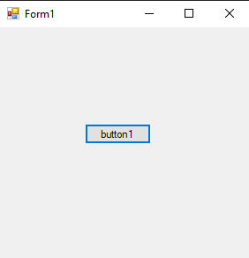

# 100-dll Snippets Code

## 1- example

### Program.cs

```c#
using System;
using System.Collections.Generic;
using System.ComponentModel;
using System.Data;
using System.Drawing;
using System.Linq;
using System.Text;
using System.Threading.Tasks;
using System.Windows.Forms;
using MyDll.Clients;

namespace WindowsFormsApplication1
{
    public partial class Form1 : Form
    {
        public Form1()
        {
            InitializeComponent();
        }

        private void button1_Click(object sender, EventArgs e)
        {

            Client c = new Client();
            c.Name = "guna";
            MessageBox.Show(c.Name);

        }
    }
}


```

### Ouput




## DLL Code example

### Program.cs

```c#


```

### Ouput


