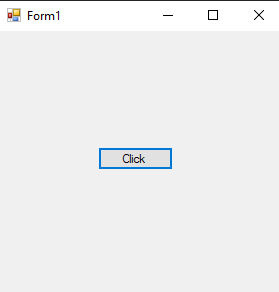
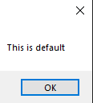
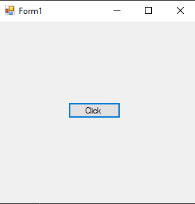
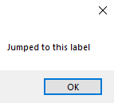
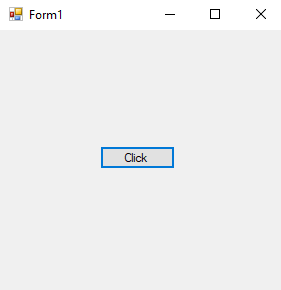
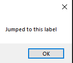

# 102-goto Snippets Code

## 1-switch example

### Program.cs

```c#
using System;
using System.Collections.Generic;
using System.ComponentModel;
using System.Data;
using System.Drawing;
using System.Linq;
using System.Text;
using System.Threading.Tasks;
using System.Windows.Forms;

namespace gotoAndRegin
{
    public partial class Form1 : Form
    {
        public Form1()
        {
            InitializeComponent();
        }

        private void button1_Click(object sender, EventArgs e)
        {

            string user = "kadksa";//default.

            switch (user)
            {

                case "guna":
                    MessageBox.Show("My name is guna");
                    break;

                case "joker":
                    MessageBox.Show("My name is joker");
                    break;

                default:
                    MessageBox.Show("This is default");
                    goto case "guna";//jumps to the case 'guna';
                    break;


            }
        }
    }
}


```

### Ouput





## 2-label-goto example

### Program.cs

```c#
using System;
using System.Collections.Generic;
using System.ComponentModel;
using System.Data;
using System.Drawing;
using System.Linq;
using System.Text;
using System.Threading.Tasks;
using System.Windows.Forms;

namespace gotoAndRegin
{
    public partial class Form1 : Form
    {
        public Form1()
        {
            InitializeComponent();
        }

        private void button1_Click(object sender, EventArgs e)
        {

            goto myCode;

            myCode: {//This is called a label code.


                MessageBox.Show("Jumped to this label");
                
            }
           
        }
    }
}

```

### Ouput




## 3-for-loop example

### Program.cs

```c#
using System;
using System.Collections.Generic;
using System.ComponentModel;
using System.Data;
using System.Drawing;
using System.Linq;
using System.Text;
using System.Threading.Tasks;
using System.Windows.Forms;

namespace gotoAndRegin
{
    public partial class Form1 : Form
    {
        public Form1()
        {
            InitializeComponent();
        }

        private void button1_Click(object sender, EventArgs e)
        {

            for (int a = 0; a <= 1000; a++) {//It will not run 1000 times
                                             //when the first time the loop run it will goto the MyCode label

                goto myCode;
            }

            myCode: {//This is called a label code.


                MessageBox.Show("Jumped to this label");
                
            }
           
        }
    }
}

```

### Ouput


