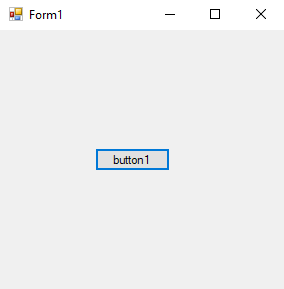
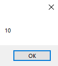
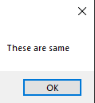
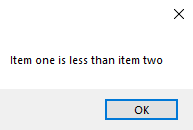
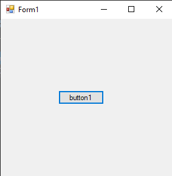
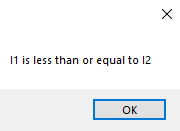
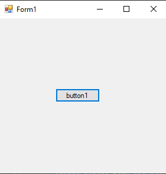
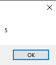

# 106-overloading-operators Snippets Code

## 1-operator-(+) example

### Program.cs

```c#
using System;
using System.Collections.Generic;
using System.ComponentModel;
using System.Data;
using System.Drawing;
using System.Linq;
using System.Text;
using System.Threading.Tasks;
using System.Windows.Forms;

namespace OverloadOprerators
{
    public partial class Form1 : Form
    {
        public Form1()
        {
            InitializeComponent();
        }

        private void button1_Click(object sender, EventArgs e)
        {

            Item item1 = new Item();
            item1.price = 4;

            Item item2 = new Item();
            item2.price = 6;


            Item item3 = item1 + item2;

            MessageBox.Show(item3.price.ToString());

        }
    }

    //I have a class called Item
    class Item {


        public int price {

            get;
            set;
        }
                                     //It needs Item types two parameter values.
        public static Item operator +(Item i1, Item i2) {


            Item i3 = new Item();
            i3.price = i1.price + i2.price;
            return i3;

        }

    }
}


```

### Ouput





## 2-operator-(==)-and-(!=) example

### Program.cs

```c#
using System;
using System.Collections.Generic;
using System.ComponentModel;
using System.Data;
using System.Drawing;
using System.Linq;
using System.Text;
using System.Threading.Tasks;
using System.Windows.Forms;

namespace OverloadOprerators
{
    public partial class Form1 : Form
    {
        public Form1()
        {
            InitializeComponent();
        }

        private void button1_Click(object sender, EventArgs e)
        {

            Item i1 = new Item();
            i1.price = 4;

            Item i2 = new Item();
            i2.price = 4;

            if (i1 == i2)
            {

                MessageBox.Show("These are same");
            }
            


        }
    }

 
    class Item {


        public int price {

            get;
            set;
        }


        public static bool operator ==(Item i1, Item i2)
        {

            return (i1.price == i2.price) ? true : false;


        }

        public static bool operator !=(Item i1, Item i2)
        {

            return (i1.price == i2.price) ? true : false;


        }

    }
}


```

### Ouput





## 3-opeator-(less-than-grater) example

### Program.cs

```c#
using System;
using System.Collections.Generic;
using System.ComponentModel;
using System.Data;
using System.Drawing;
using System.Linq;
using System.Text;
using System.Threading.Tasks;
using System.Windows.Forms;

namespace OverloadOprerators
{
    public partial class Form1 : Form
    {
        public Form1()
        {
            InitializeComponent();
        }

        private void button1_Click(object sender, EventArgs e)
        {

            Item i1 = new Item();
            i1.price = 4;

            Item i2 = new Item();
            i2.price = 5;


            if (i1 < i2) {

                MessageBox.Show("Item one is less than item two");

            }

            if (i2 > i1) {

                MessageBox.Show("Item two cost more than item one");
            }

        }
    }

 
    class Item {


        public int price {

            get;
            set;
        }


        public static bool operator <(Item i1, Item i2) {


            return (i1.price < i2.price) ? true : false;

        }

        public static bool operator >(Item i1, Item i2)
        {


            return (i1.price > i2.price) ? true : false;

        }

    }
}


```

### Ouput




## 4-operator-(less-than-or-equal) example

### Program.cs

```c#
using System;
using System.Collections.Generic;
using System.ComponentModel;
using System.Data;
using System.Drawing;
using System.Linq;
using System.Text;
using System.Threading.Tasks;
using System.Windows.Forms;

namespace OverloadOprerators
{
    public partial class Form1 : Form
    {
        public Form1()
        {
            InitializeComponent();
        }

        private void button1_Click(object sender, EventArgs e)
        {

            Item i1 = new Item();
            i1.price = 4;

            Item i2 = new Item();
            i2.price = 5;

            if (i1 <= i2) {

                MessageBox.Show("I1 is less than or equal to I2");
            }

            if (i2 >= i1) {

                MessageBox.Show("I2 is grater than or equal to I1");
            }

           

        }
    }

 
    class Item {


        public int price {

            get;
            set;
        }


        public static bool operator <=(Item i1, Item i2) {

            return (i1.price <= i2.price) ? true : false;


        }

        public static bool operator >=(Item i1, Item i2)
        {
            return (i1.price >= i2.price) ? true : false;

        }

    }
}

```

### Ouput





## 05.Operator (++ --) example

### Program.cs

```c#
using System;
using System.Collections.Generic;
using System.ComponentModel;
using System.Data;
using System.Drawing;
using System.Linq;
using System.Text;
using System.Threading.Tasks;
using System.Windows.Forms;

namespace OverloadOprerators
{
    public partial class Form1 : Form
    {
        public Form1()
        {
            InitializeComponent();
        }

        private void button1_Click(object sender, EventArgs e)
        {

            Item i = new Item();
            i.price = 4;
            i++;
            MessageBox.Show(i.price.ToString());

            Item i2 = new Item();
            i2.price = 5;
            i2--;
            MessageBox.Show(i2.price.ToString());


        }
    }

 
    class Item {


        public int price {

            get;
            set;
        }


        public static Item operator ++(Item item) {

            Item i = new Item();
            i.price = item.price + 1;
            return i;
        }

        public static Item operator --(Item item)
        {

            Item i = new Item();
            i.price = item.price - 1;
            return i;
        }

    }
}

```

### Ouput


