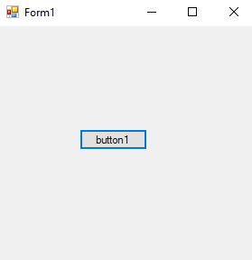
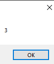
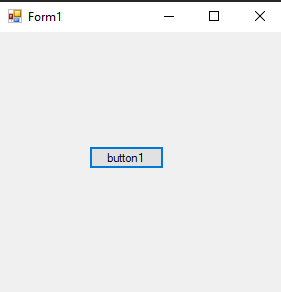
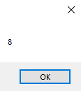

# 108-ref-keyword Snippets Code

## 1-copy-of-the-variable example

### Program.cs

```c#
using System;
using System.Collections.Generic;
using System.ComponentModel;
using System.Data;
using System.Drawing;
using System.Linq;
using System.Text;
using System.Threading.Tasks;
using System.Windows.Forms;

namespace refer
{
    public partial class Form1 : Form
    {
        public Form1()
        {
            InitializeComponent();
        }

        private void button1_Click(object sender, EventArgs e)
        {

            int Age = 3;
            modify(Age); //It does not change the value to 8.Because we are passing the copy of the variable Age.
                         // If we want to be 8 we need to pass the reference of the variable.
            MessageBox.Show(Age.ToString()); //It would be 3  not 8.


        }


        void modify(int age) {

            age += 5;

        }
    }
}


```

### Ouput




## 2-ref-of-the-variable example

### Program.cs

```c#
using System;
using System.Collections.Generic;
using System.ComponentModel;
using System.Data;
using System.Drawing;
using System.Linq;
using System.Text;
using System.Threading.Tasks;
using System.Windows.Forms;

namespace refer
{
    public partial class Form1 : Form
    {
        public Form1()
        {
            InitializeComponent();
        }

        private void button1_Click(object sender, EventArgs e)
        {

            int Age = 3;
            modify(ref Age);
            MessageBox.Show(Age.ToString()); //It would be 8  because we are passing the reference of the variable Age.
            
        }


        void modify(ref int age) {

            age += 5;

        }
    }
}


```

### Ouput


