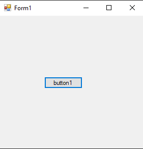
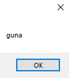

# 109-out-keyword Snippets Code

## outKey example

### Program.cs

```c#
using System;
using System.Collections.Generic;
using System.ComponentModel;
using System.Data;
using System.Drawing;
using System.Linq;
using System.Text;
using System.Threading.Tasks;
using System.Windows.Forms;

namespace outKey
{
    public partial class Form1 : Form
    {
        public Form1()
        {
            InitializeComponent();
        }

        private void button1_Click(object sender, EventArgs e)
        {

            string name;

            modify(out name);//with the help out keyword we can pass empty variable.

            MessageBox.Show(name);

        }


        void modify(out string name) {//we need to give value for it.

            name = "guna";
        }
    }
}


```

### Ouput





