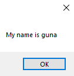

# 111-method-overloading Snippets Code

## OptionalParameter example

### Program.cs

```c#
using System;
using System.Collections.Generic;
using System.ComponentModel;
using System.Data;
using System.Drawing;
using System.Linq;
using System.Text;
using System.Threading.Tasks;
using System.Windows.Forms;

namespace OptionalParameter
{
    public partial class Form1 : Form
    {
        public Form1()
        {
            InitializeComponent();
        }

        private void button1_Click(object sender, EventArgs e)
        {

            ShowMsg("guna");

        }

        void ShowMsg(string name) {


            MessageBox.Show("My name is " + name);

        }

        void ShowMsg(string name,int age) {


            MessageBox.Show("My name is " + name + " and my age is " + age);
            
        }

        //This is called method overloading.
        //We can have many overloaded methods like this.

    }
}


```

### Ouput





