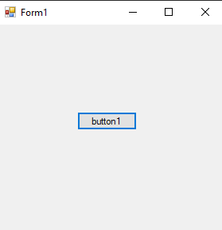
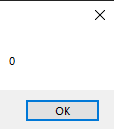

# 113-ienumerable Snippets Code

## OptionalParameter example

### Program.cs

```c#
using System;
using System.Collections.Generic;
using System.ComponentModel;
using System.Data;
using System.Drawing;
using System.Linq;
using System.Text;
using System.Threading.Tasks;
using System.Windows.Forms;
using System.Collections;//Must be

namespace OptionalParameter
{
    public partial class Form1 : Form
    {
        public Form1()
        {
            InitializeComponent();
        }

        private void button1_Click(object sender, EventArgs e)
        {


            foreach (int i in getNumbers(0,10))
            {
                if (i == 3) {

                    break;
                }

                MessageBox.Show(i.ToString());
                
            }

        }


        IEnumerable getNumbers(int min, int max)
        {

            for (; min <= max; min++)
            {

              yield return min;
              //yield return will return all numbers back.
              //but we can use depanding on our needs.

            }

        }
       
    }
}


```

### Ouput





