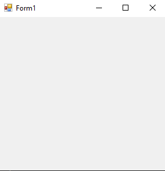

# 114-file-system-watcher Snippets Code

## notify example

### Program.cs

```c#
using System;
using System.Collections.Generic;
using System.ComponentModel;
using System.Data;
using System.Drawing;
using System.Linq;
using System.Text;
using System.Threading.Tasks;
using System.Windows.Forms;
using System.IO;

namespace notify
{
    public partial class Form1 : Form
    {
        public Form1()
        {
            InitializeComponent();
        }

        private void Form1_Load(object sender, EventArgs e)
        {

            //FileSystemWatcher is notifier like when a file created or delete or move renamed and so on.


            FileSystemWatcher fsw = new FileSystemWatcher();
            fsw.Path = Environment.GetFolderPath(Environment.SpecialFolder.Desktop);     //we have selected the Desktop.It is the distination.
            fsw.NotifyFilter = NotifyFilters.LastWrite | NotifyFilters.FileName;         //we notify for file lastWrite and fileName rechanged.
            fsw.Filter = "*.txt";                                                        //we check Only txt file. if we want to check all file we must use ".";
            fsw.Changed += Fsw_Changed;                                                  //when the file saved.
            fsw.Renamed += Fsw_Renamed;                                                  //When the file renamed.
            fsw.EnableRaisingEvents = true;                                              //we must set this property to true if we don't, Events won't work for FileSystemWatcher.
            
        }

        private void Fsw_Renamed(object sender, RenamedEventArgs e)
        {
            MessageBox.Show("Text file has been renamed");
        }

        private void Fsw_Changed(object sender, FileSystemEventArgs e)
        {
            MessageBox.Show("You have saved txt file");
        }
    }
}


```

### Ouput




