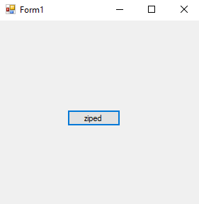
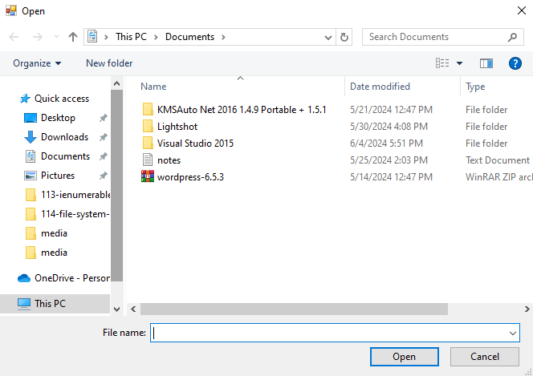
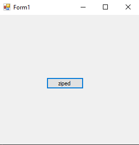
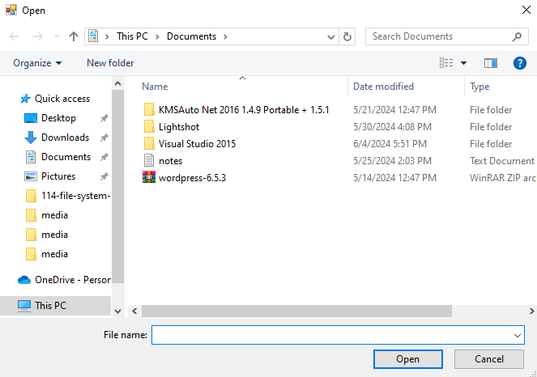

# 115-zip-files Snippets Code

## 1-example

### Program.cs

```c#
using System;
using System.Collections.Generic;
using System.ComponentModel;
using System.Data;
using System.Drawing;
using System.Linq;
using System.Text;
using System.Threading.Tasks;
using System.Windows.Forms;
using Ionic.Zip; //must be it's an external library. Becuase MS does not have it.

namespace zipfile2
{
    public partial class Form1 : Form
    {
        public Form1()
        {
            InitializeComponent();
        }

        private void button1_Click(object sender, EventArgs e)
        {

            OpenFileDialog ofd = new OpenFileDialog();

            if (ofd.ShowDialog() == DialogResult.OK) {

                ZipFile zp = new ZipFile("C:\\Users\\Joker Hacker\\Desktop\\guna.zip"); //path and name of the zipfile.
                zp.AddFile(ofd.FileName,""); //If we don't put "" This will add files with the directory that user select files from.
                zp.Save();                   //if we need the directories also we do not need to use "".

                
            }

        }
    }
}


```

### Ouput




## 2-add-directory-by-name example

### Program.cs

```c#
using System;
using System.Collections.Generic;
using System.ComponentModel;
using System.Data;
using System.Drawing;
using System.Linq;
using System.Text;
using System.Threading.Tasks;
using System.Windows.Forms;
using Ionic.Zip; //must be it's an external library. Becuase MS does not have it.

namespace zipfile2
{
    public partial class Form1 : Form
    {
        public Form1()
        {
            InitializeComponent();
        }

        private void button1_Click(object sender, EventArgs e)
        {

            OpenFileDialog ofd = new OpenFileDialog();

            if (ofd.ShowDialog() == DialogResult.OK) {


                ZipFile zp = new ZipFile("C:\\Users\\Joker Hacker\\Desktop\\guna.zip");
                zp.AddDirectoryByName("files");//Created a directory called files.
                zp.AddFile(ofd.FileName, "files");//put the directory name.
                zp.Save();

                //This program will create a folder called files and put the selected file in it.
                
            }

        }
    }
}


```

### Ouput


