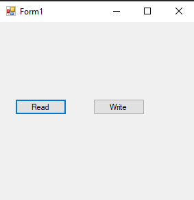
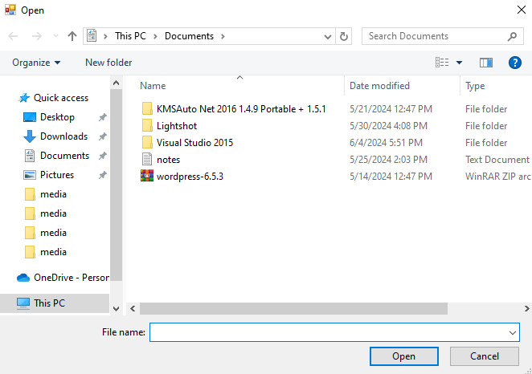

# 118-binary-reader-and-writter Snippets Code

## BinaryReaderPro example

### Program.cs

```c#
using System;
using System.Collections.Generic;
using System.ComponentModel;
using System.Data;
using System.Drawing;
using System.Text;
using System.Windows.Forms;
using SystemIO;
namespace BinaryReaderPro
{
    public partial class Form1 : Form
    {
        public Form1()
        {
            InitializeComponent();
        }

        private void button1_Click(object sender, EventArgs e)
        {
            OpenFileDialog ofd = new OpenFileDialog();

            if (ofd.ShowDialog() == DialogResult.OK) {

                Reader r = new Reader(ofd.FileName);
                MessageBox.Show(r.Readint32().ToString("X"));
            }
        }

        private void button2_Click(object sender, EventArgs e)
        {
            OpenFileDialog ofd = new OpenFileDialog();

            if (ofd.ShowDialog() == DialogResult.OK) {

                writter w = new writter(ofd.FileName);

                w.writeString("kida");
                w.Close();

            }
        }
    }
}


```

### Ouput



