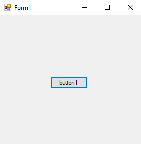
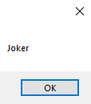
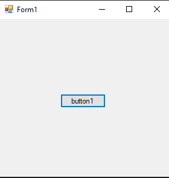

# 121-clone Snippets Code

## 1-basic example

### Program.cs

```c#
using System;
using System.Collections.Generic;
using System.ComponentModel;
using System.Data;
using System.Drawing;
using System.Text;
using System.Windows.Forms;

namespace Clonesys
{
    public partial class Form1 : Form
    {
        public Form1()
        {
            InitializeComponent();
        }

        private void button1_Click(object sender, EventArgs e)
        {
            string name = "Joker";
            string cloeData = (string)name.Clone();
            MessageBox.Show(cloeData);
        }
    }
}


```

### Ouput





## 2-clone-class example

### Program.cs

```c#
using System;
using System.Collections.Generic;
using System.ComponentModel;
using System.Data;
using System.Drawing;
using System.Text;
using System.Windows.Forms;

namespace Clonesys
{
    public partial class Form1 : Form
    {
        public Form1()
        {
            InitializeComponent();
        }

        private void button1_Click(object sender, EventArgs e)
        {

            myclass m = new myclass();
            m.name = "guna";
            myclass cloneClass = (myclass)m.Clone();
            MessageBox.Show(cloneClass.name);


        }
    }

    class myclass : ICloneable {

        public string name {

            get;
            set;

        }

        public object Clone() {

            return this;
        }
    }
}


//This is how we can clone the class.

```

### Ouput



