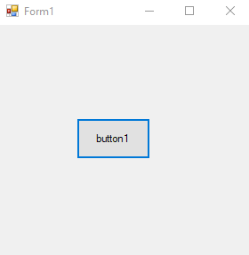
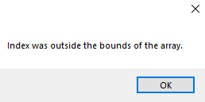

# 13-try-catch-finally Snippets Code

## 1- Example

### Program.cs

```c#
using System;
using System.Collections.Generic;
using System.ComponentModel;
using System.Data;
using System.Drawing;
using System.Linq;
using System.Text;
using System.Threading.Tasks;
using System.Windows.Forms;

namespace tryandcatch
{
    public partial class Form1 : Form
    {
        public Form1()
        {
            InitializeComponent();
        }

        private void button1_Click(object sender, EventArgs e)
        {

           

            try
            {

                string[] names = new string[2];//we made two cache array.
                names[2] = "guna";//we have sat to 3 chche that is avaliable.


            }
            catch 
            {

                MessageBox.Show("2 is not avaliable");
            }

        }
    }
}


```

### Ouput




## 2-with-finally Example

### Program.cs

```c#
using System;
using System.Collections.Generic;
using System.ComponentModel;
using System.Data;
using System.Drawing;
using System.Linq;
using System.Text;
using System.Threading.Tasks;
using System.Windows.Forms;

namespace tryandcatch
{
    public partial class Form1 : Form
    {
        public Form1()
        {
            InitializeComponent();
        }

        private void button1_Click(object sender, EventArgs e)
        {


            try
            {

                string[] names = new string[2];//we made two cache array.
                names[2] = "guna";//we have sat to 3 chche that is avaliable.

            }
            catch (Exception ex)
            {

                MessageBox.Show(ex.Message);
                //This will print out the message that the c# provides.
            }
            finally {

                //finally works even though error or not  
                MessageBox.Show("Error checking is completed");

            }
          

        }
    }
}

```

### Ouput





