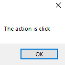
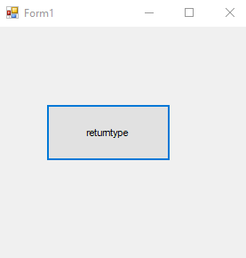
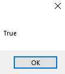

# 14-method Snippets Code

## 1- Example

### Program.cs

```c#
using System;
using System.Collections.Generic;
using System.ComponentModel;
using System.Data;
using System.Drawing;
using System.Linq;
using System.Text;
using System.Threading.Tasks;
using System.Windows.Forms;

namespace method
{
    public partial class Form1 : Form
    {
        public Form1()
        {
            InitializeComponent();
        }

        private void button1_Click(object sender, EventArgs e)
        {

            //invoke the displayMethod when the user click the button.
            displayMethod();

        }
        private void button2_MouseHover(object sender, EventArgs e)
        {
            //invoke the displayMethod when the user mouseover the button.
            displayMethod();
        }

        void displayMethod() {


            MessageBox.Show("Hai my name is guna");

        }

        
    }
}

```

### Ouput


## 2-method-paramete Example

### Program.cs

```c#
using System;
using System.Collections.Generic;
using System.ComponentModel;
using System.Data;
using System.Drawing;
using System.Linq;
using System.Text;
using System.Threading.Tasks;
using System.Windows.Forms;

namespace method
{
    public partial class Form1 : Form
    {
        public Form1()
        {
            InitializeComponent();
        }

        private void button1_Click(object sender, EventArgs e)
        {

           
            displayMethod("click");

        }
        private void button2_MouseHover(object sender, EventArgs e)
        {
           
            displayMethod("mouseover");
        }

        void displayMethod(string name) {


            MessageBox.Show("The action is "+name);

        }

        
    }
}
//method takes parameters values.


```

### Ouput




## 3-return-types Example

### Program.cs

```c#
using System;
using System.Collections.Generic;
using System.ComponentModel;
using System.Data;
using System.Drawing;
using System.Linq;
using System.Text;
using System.Threading.Tasks;
using System.Windows.Forms;

namespace methodretuen
{
    public partial class Form1 : Form
    {
        public Form1()
        {
            InitializeComponent();
        }

        private void button1_Click(object sender, EventArgs e)
        {

            string name = printme("kuna");
            MessageBox.Show(name);


        }

        string printme(string n) {

            return n;
            
        }

        //if we put the data type instead of void mean we are returning.
        //void means execute the method.
        //data type means return the value back.
    }
}

```
### Ouput


## 4-advanced Example

### Program.cs

```c#
using System;
using System.Collections.Generic;
using System.ComponentModel;
using System.Data;
using System.Drawing;
using System.Linq;
using System.Text;
using System.Threading.Tasks;
using System.Windows.Forms;

namespace method
{
    public partial class Form1 : Form
    {
        public Form1()
        {
            InitializeComponent();
        }

        private void button1_Click(object sender, EventArgs e)
        {

           
            displayMethod("click");

        }
        private void button2_MouseHover(object sender, EventArgs e)
        {
           
            displayMethod("mouseover");
        }

        void displayMethod(string name) {


            MessageBox.Show("The action is "+name);

        }

        
    }
}
//method takes parameters values.

```
### Ouput


## 5-return-type-boolean Example

### Program.cs

```c#
using System;
using System.Collections.Generic;
using System.ComponentModel;
using System.Data;
using System.Drawing;
using System.Linq;
using System.Text;
using System.Threading.Tasks;
using System.Windows.Forms;

namespace retutnetho
{
    public partial class Form1 : Form
    {
        public Form1()
        {
            InitializeComponent();
        }

        private void button1_Click(object sender, EventArgs e)
        {


            bool val=callMe(true);
            MessageBox.Show(val.ToString());

        }


        bool callMe(bool h) {

            return h;
            
        }
    }
}

```
### Ouput





