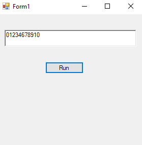

# 16-continue Snippets Code

## ConBrack Example

### Program.cs

```c#
using System;
using System.Collections.Generic;
using System.ComponentModel;
using System.Data;
using System.Drawing;
using System.Linq;
using System.Text;
using System.Threading.Tasks;
using System.Windows.Forms;

namespace ConBrack
{
    public partial class Form1 : Form
    {
        public Form1()
        {
            InitializeComponent();
        }

        private void Form1_Load(object sender, EventArgs e)
        {

        }

        private void button1_Click(object sender, EventArgs e)
        {


            for (int u = 0; u <= 10; u++) {

                if (u == 5) {

                    continue;

                }

                richTextBox1.Text += u.ToString();
                //+= appeding

            }

        }
    }
}

//the continue statement will juump one iteration over. 

```

### Ouput





