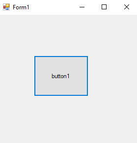
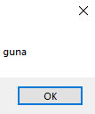

# 17-nameSpace Snippets Code

## nameSpace Example

### Program.cs

```c#
using System;
using System.Collections.Generic;
using System.ComponentModel;
using System.Data;
using System.Drawing;
using System.Linq;
using System.Text;
using System.Threading.Tasks;
using System.Windows.Forms;
using gunaname.robo1.robo2;

namespace nameSpace
{
    public partial class Form1 : Form
    {
        public Form1()
        {
            InitializeComponent();
        }

        private void button1_Click(object sender, EventArgs e)
        {

            maker m = new maker();
            MessageBox.Show(m.name);
        }
    }
}

```

### Ouput





