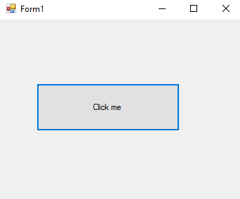

# 2-variables Snippets Code

## variables Example

### Program.cs

```c#
using System;
using System.Collections.Generic;
using System.ComponentModel;
using System.Data;
using System.Drawing;
using System.Linq;
using System.Text;
using System.Threading.Tasks;
using System.Windows.Forms;

namespace variables
{
    public partial class Form1 : Form
    {
        public Form1()
        {
            InitializeComponent();
        }

        private void button1_Click(object sender, EventArgs e)
        {

            //This is string data type
            
            string name = "kuna";
      

            
            //it can store points numbers.
            double num2 = 10.5566;

            //floating point numbers.
            float fnum = 55.554f;

            //boolean
            bool bo = false;

            //byte is 8 bit numbers it can store numbers within 255.

            byte bnum = 255;

            //short is 16 bit.
            short snum = 684;
            //short and int16 and same.
            Int16 int16num = 684;

            //This is integer it can store only whole numbers. 32 bit. 
            int num1 = 10;
            
            //int and int32 are same.
            Int32 num32num = 665;


            //64 bit
            long longnum = 56566546;

            //long and int64 are same.
            Int64 int64num = 565569569;

            //object can accpect all data types like loosely typed.

            object obj = "guna";
            object obj2 = 5656;
            object obj3 = 56896.656;

            //var is also like object.

            var car = "BWW";
            var model = 5656;
            var price = 5656.5656;


            

        }
    }
}

```

### Ouput




      


