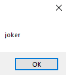

# 22-properties Snippets Code

## 1- Example

### Program.cs

```c#
using System;
using System.Collections.Generic;
using System.ComponentModel;
using System.Data;
using System.Drawing;
using System.Linq;
using System.Text;
using System.Threading.Tasks;
using System.Windows.Forms;
using properName;

namespace proper
{
    public partial class Form1 : Form
    {
        public Form1()
        {
            InitializeComponent();
        }

        private void button1_Click(object sender, EventArgs e)
        {

            Myclass mc = new Myclass("Guna");
            mc.Name = "Joker";//I can change the value because i have setter in the property.
            MessageBox.Show(mc.Name);//I got this value from a getter.


        }
    }
}

```

### Ouput


## 2- Example

### Program.cs

```c#


```

### Ouput


## 3- Example

### Program.cs

```c#
using System;
using System.Collections.Generic;
using System.ComponentModel;
using System.Data;
using System.Drawing;
using System.Linq;
using System.Text;
using System.Threading.Tasks;
using System.Windows.Forms;
using properName;

namespace proper
{
    public partial class Form1 : Form
    {
        public Form1()
        {
            InitializeComponent();
        }

        private void button1_Click(object sender, EventArgs e)
        {

            Myclass mc = new Myclass("Guna");
            mc.Name = "joker";
            MessageBox.Show(mc.Name);//I got this value from a getter.


        }
    }
}


```

### Ouput





