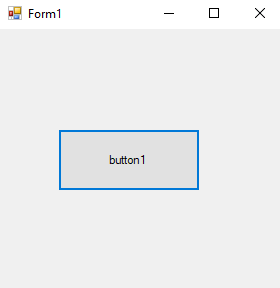
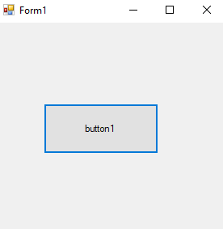
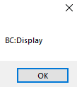

# 25-override-inheritance Snippets Code

## 1- example

### Program.cs

```c#
using System;
using System.Collections.Generic;
using System.ComponentModel;
using System.Data;
using System.Drawing;
using System.Linq;
using System.Text;
using System.Threading.Tasks;
using System.Windows.Forms;
using Inhername;

namespace Inher
{
    public partial class Form1 : Form
    {
        public Form1()
        {
            InitializeComponent();
        }

        private void button1_Click(object sender, EventArgs e)
        {

            Dog d1 = new Dog();
            d1.great();


        }
    }
}


```

### Ouput




## 2- example

### Program.cs

```c#
using System;
using System.Collections.Generic;
using System.ComponentModel;
using System.Data;
using System.Drawing;
using System.Linq;
using System.Text;
using System.Threading.Tasks;
using System.Windows.Forms;
using Inhername;

namespace Inher
{
    public partial class Form1 : Form
    {
        public Form1()
        {
            InitializeComponent();
        }

        private void button1_Click(object sender, EventArgs e)
        {


            BC b = new BC();
            b.Display();

            DC d = new DC();
            d.Display();

            TC t = new TC();
            t.Display();

        }
    }
}


```
### Ouput





