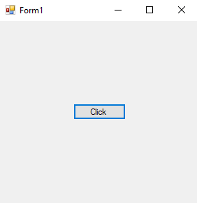

# 26-indexer Snippets Code

## 1-example

### Program.cs

```c#
using System;
using System.Collections.Generic;
using System.ComponentModel;
using System.Data;
using System.Drawing;
using System.Linq;
using System.Text;
using System.Threading.Tasks;
using System.Windows.Forms;
using Indexersname;

namespace Indexers
{
    public partial class Form1 : Form
    {
        public Form1()
        {
            InitializeComponent();
        }

        private void button1_Click(object sender, EventArgs e)
        {

            inder i = new inder();
            MessageBox.Show(i[0]);


        }
    }
}


```

### Ouput


## 2-example

### Program.cs

```c#
using System;
using System.Collections.Generic;
using System.ComponentModel;
using System.Data;
using System.Drawing;
using System.Linq;
using System.Text;
using System.Threading.Tasks;
using System.Windows.Forms;
using Indexersname;

namespace Indexers
{
    public partial class Form1 : Form
    {
        public Form1()
        {
            InitializeComponent();
        }

        private void button1_Click(object sender, EventArgs e)
        {

            inder obj = new inder();
            obj[0] = "One";
            obj[1] = "Two";
            obj[2] = "Three";

            MessageBox.Show(obj[0]);


        }
    }
}


```

### Ouput




