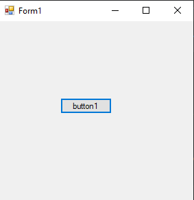
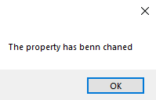

# 31-evant Snippets Code

## structt example

### Program.cs

```c#
using System;
using System.Collections.Generic;
using System.ComponentModel;
using System.Data;
using System.Drawing;
using System.Linq;
using System.Text;
using System.Threading.Tasks;
using System.Windows.Forms;
using structtname;

namespace structt
{
    public partial class Form1 : Form
    {
        public Form1()
        {
            InitializeComponent();
        }

        private void button1_Click(object sender, EventArgs e)
        {

            myClass m = new myClass();
            m.ownPropertyChanged += M_ownPropertyChanged;
            m.NamePro = "guna";
          

        }

        private void M_ownPropertyChanged(object sender, EventArgs e)
        {
            MessageBox.Show("The property has benn chaned");
        }
    }
}


```

### Ouput





