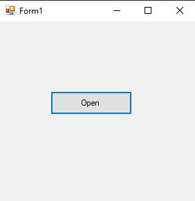
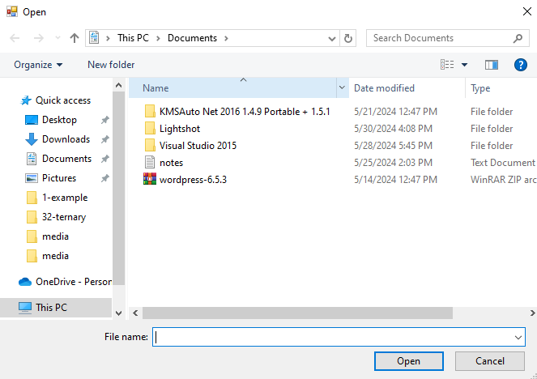
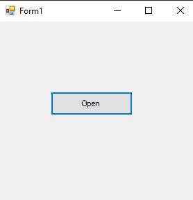
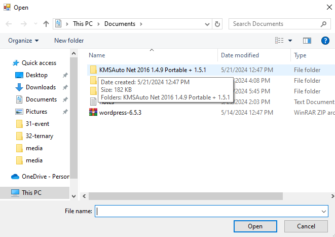

# 33-open-file-dialog Snippets Code

## 1- example

### Program.cs

```c#
using System;
using System.Collections.Generic;
using System.ComponentModel;
using System.Data;
using System.Drawing;
using System.Linq;
using System.Text;
using System.Threading.Tasks;
using System.Windows.Forms;

namespace openfildia
{
    public partial class Form1 : Form
    {
        public Form1()
        {
            InitializeComponent();
        }

        private void button1_Click(object sender, EventArgs e)
        {

            OpenFileDialog ofd = new OpenFileDialog();

            if (ofd.ShowDialog() == DialogResult.OK) {//if the user select an item

                MessageBox.Show("The user has seleted an item");

            }
        }
    }
}

```
### Ouput





## 2- example

### Program.cs

```c#
using System;
using System.Collections.Generic;
using System.ComponentModel;
using System.Data;
using System.Drawing;
using System.Linq;
using System.Text;
using System.Threading.Tasks;
using System.Windows.Forms;

namespace openfildia
{
    public partial class Form1 : Form
    {
        public Form1()
        {
            InitializeComponent();
        }

        private void button1_Click(object sender, EventArgs e)
        {

            OpenFileDialog ofd = new OpenFileDialog();

            ofd.Title = "Select a image file Jpg or png";//Title for it.

            ofd.Filter = "PNG Image|*x.png|JPG image|*.jpg";//file types that shoud supports.

            if (ofd.ShowDialog() == DialogResult.OK) {//if the user select an item

                MessageBox.Show(ofd.FileName);//returns the path

            }
        }
    }
}

```
### Ouput





