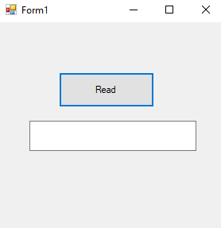
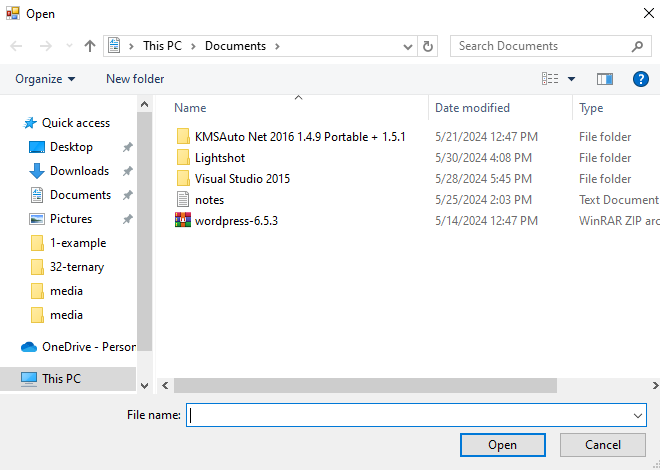
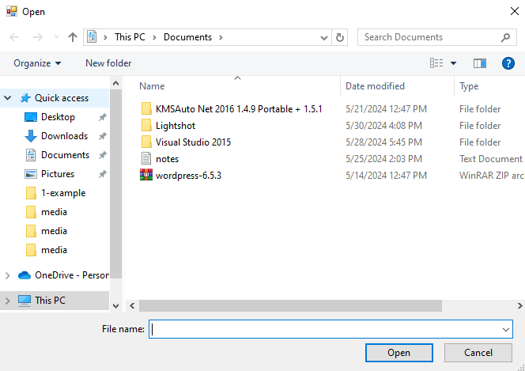
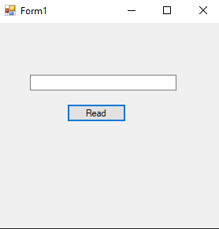
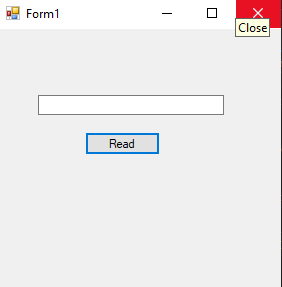
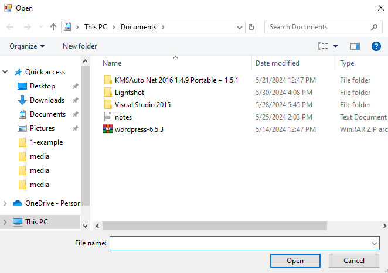
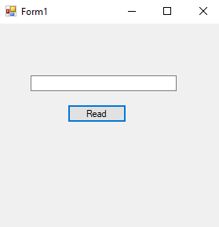
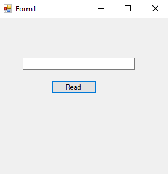
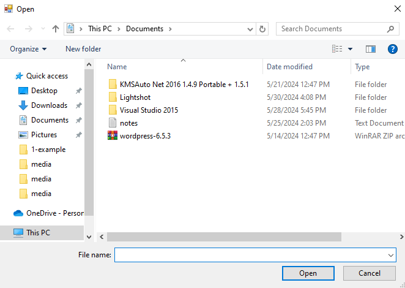

# 34-stream-reader Snippets Code

## 1- example

### Program.cs

```c#
using System;
using System.Collections.Generic;
using System.ComponentModel;
using System.Data;
using System.Drawing;
using System.Linq;
using System.Text;
using System.Threading.Tasks;
using System.Windows.Forms;
using System.IO;

namespace Streamreader
{
    public partial class Form1 : Form
    {
        public Form1()
        {
            InitializeComponent();
        }

        private void button1_Click(object sender, EventArgs e)
        {
            OpenFileDialog ofd = new OpenFileDialog();

            if (ofd.ShowDialog() == DialogResult.OK) {

                StreamReader sr = new StreamReader(ofd.FileName);
                textBox1.Text = sr.ReadToEnd();
                sr.Dispose();//we need to close the streamReader after reading.
                
            }
            
        }
    }
}


//using System.IO; is the important class.
//StreamReader is the class for reading.

```
### Ouput





## 2-base-stream-decimal example

### Program.cs

```c#
using System;
using System.Collections.Generic;
using System.ComponentModel;
using System.Data;
using System.Drawing;
using System.Linq;
using System.Text;
using System.Threading.Tasks;
using System.Windows.Forms;
using System.IO;

namespace StreamREader2
{
    public partial class Form1 : Form
    {
        public Form1()
        {
            InitializeComponent();
        }

        private void button1_Click(object sender, EventArgs e)
        {
            OpenFileDialog ofd = new OpenFileDialog();


            if (ofd.ShowDialog() == DialogResult.OK) {

                StreamReader sr = new StreamReader(ofd.FileName);
                textBox1.Text = sr.BaseStream.ReadByte().ToString();
                
                //This will convert the string into decimal.
                //BaseStream only reads 1 char.

                 
                
            }
        }
    }
}


```
### Ouput





## 3-base-stream-hex example

### Program.cs

```c#
using System;
using System.Collections.Generic;
using System.ComponentModel;
using System.Data;
using System.Drawing;
using System.Linq;
using System.Text;
using System.Threading.Tasks;
using System.Windows.Forms;
using System.IO;

namespace StreamREader2
{
    public partial class Form1 : Form
    {
        public Form1()
        {
            InitializeComponent();
        }

        private void button1_Click(object sender, EventArgs e)
        {
            OpenFileDialog ofd = new OpenFileDialog();


            if (ofd.ShowDialog() == DialogResult.OK) {

                StreamReader sr = new StreamReader(ofd.FileName);
                textBox1.Text = sr.BaseStream.ReadByte().ToString("X");//X wil convert into HexDecimal.
                
                //This will convert the string into Hex.
                //BaseStream only reads 1 char.

                 
                
            }
        }
    }
}


```
### Ouput




## 4-buffer-multiple-reading example

### Program.cs

```c#

using System;
using System.Collections.Generic;
using System.ComponentModel;
using System.Data;
using System.Drawing;
using System.Linq;
using System.Text;
using System.Threading.Tasks;
using System.Windows.Forms;
using System.IO;

namespace StreamREader2
{
    public partial class Form1 : Form
    {
        public Form1()
        {
            InitializeComponent();
        }

        private void button1_Click(object sender, EventArgs e)
        {

            OpenFileDialog openfileDia = new OpenFileDialog();

            if (openfileDia.ShowDialog() == DialogResult.OK) {

                StreamReader stream = new StreamReader(openfileDia.FileName);
                byte[] buffer = new byte[3];//We have created a byte array.
                stream.BaseStream.Read(buffer,0,3);//We Store the value in the buffer array.

                foreach (byte item in buffer)//we loop the buffer array.
                {

                    textBox1.Text += item.ToString("X") + " ";
                    stream.Dispose();
                    //we convert them into HexDecimal.
                    //If we don't put X that will automatically converts into decimal.


                }


            }
            
        }
    }
}

```
### Ouput





## 5-buffer-multiple-reading-posistion example

### Program.cs

```c#
using System;
using System.Collections.Generic;
using System.ComponentModel;
using System.Data;
using System.Drawing;
using System.Linq;
using System.Text;
using System.Threading.Tasks;
using System.Windows.Forms;
using System.IO;

namespace StreamREader2
{
    public partial class Form1 : Form
    {
        public Form1()
        {
            InitializeComponent();
        }

        private void button1_Click(object sender, EventArgs e)
        {

            OpenFileDialog openfileDia = new OpenFileDialog();

            if (openfileDia.ShowDialog() == DialogResult.OK) {

                StreamReader stream = new StreamReader(openfileDia.FileName);
                stream.BaseStream.Position = 4;//This is the position where to start read.
                byte[] buffer = new byte[3];
                stream.BaseStream.Read(buffer,0,3);

                foreach (byte item in buffer)
                {
                    textBox1.Text += item.ToString("X") + " ";
                    stream.Dispose();
                    
                    
                }


            }
            
        }
    }
}

```
### Ouput




## 6-peek-vs-read example

### Program.cs

```c#
using System;
using System.Collections.Generic;
using System.ComponentModel;
using System.Data;
using System.Drawing;
using System.Linq;
using System.Text;
using System.Threading.Tasks;
using System.Windows.Forms;
using System.IO;

namespace StreamREader2
{
    public partial class Form1 : Form
    {
        public Form1()
        {
            InitializeComponent();
        }

        private void button1_Click(object sender, EventArgs e)
        {

            OpenFileDialog openfileDia = new OpenFileDialog();

            if (openfileDia.ShowDialog() == DialogResult.OK) {

                StreamReader sr = new StreamReader(openfileDia.FileName);
                char c = (char)sr.Peek();//we convert the peek value into char.
                char c1 = (char)sr.Peek(); //Peek does not change it's position.
                char c2=(char)sr.Read(); //We convert the read value into char.
                char c3 = (char)sr.Read();//Read does change it's position after it's reading.


                MessageBox.Show(c+" "+c1+" "+c2+" " +c3);


            }
            
        }
    }
}

```

### Ouput


