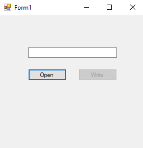
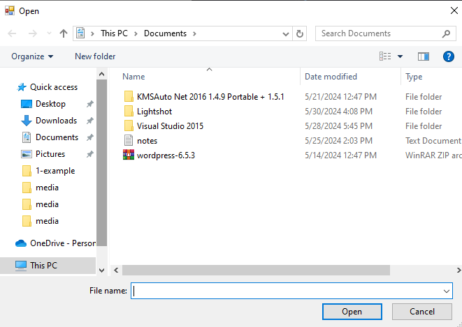
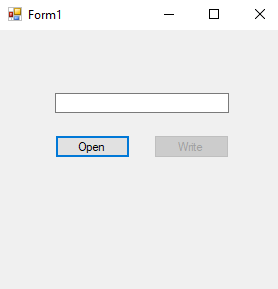
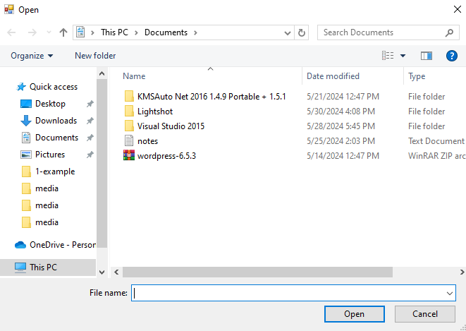
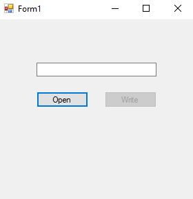
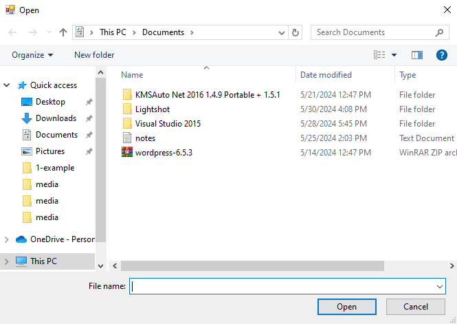
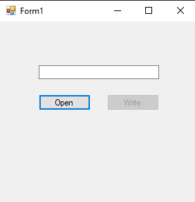
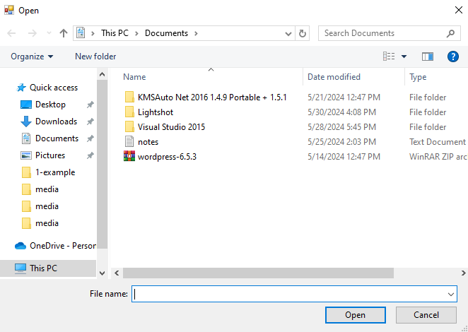

# 35-stream-writter Snippets Code

## 1- example

### Program.cs

```c#
using System;
using System.Collections.Generic;
using System.ComponentModel;
using System.Data;
using System.Drawing;
using System.Linq;
using System.Text;
using System.Threading.Tasks;
using System.Windows.Forms;
using System.IO;

namespace StremWriter
{
    public partial class Form1 : Form
    {
        public Form1()
        {
            InitializeComponent();
        }

        string path;

        private void button1_Click(object sender, EventArgs e)
        {

            OpenFileDialog ofd = new OpenFileDialog();

            if (ofd.ShowDialog() == DialogResult.OK) {

                path = ofd.FileName;
                button2.Enabled = true;

            }

        }

        private void button2_Click(object sender, EventArgs e)
        {

            StreamWriter sw = new StreamWriter(File.OpenWrite(path));
            sw.Write(textBox1.Text);//we can also use writeLine()
            sw.Dispose();//closed.

        }

    }
}


```
### Ouput





## 2- example

### Program.cs

```c#
using System;
using System.Collections.Generic;
using System.ComponentModel;
using System.Data;
using System.Drawing;
using System.Linq;
using System.Text;
using System.Threading.Tasks;
using System.Windows.Forms;
using System.IO;

namespace StremWriter
{
    public partial class Form1 : Form
    {
        public Form1()
        {
            InitializeComponent();
        }

        string path;

        private void button1_Click(object sender, EventArgs e)
        {

            OpenFileDialog ofd = new OpenFileDialog();

            if (ofd.ShowDialog() == DialogResult.OK) {

                path = ofd.FileName;
                button2.Enabled = true;

            }

        }

        private void button2_Click(object sender, EventArgs e)
        {

            StreamWriter sw = new StreamWriter(File.OpenWrite(path));
            sw.Write(textBox1.Text);
            sw.Dispose();//closed.
            sw.WriteLine("Hello");
            sw.Write("My name is guna");
            sw.Write("I konw java");

        }

    }
}


```
### Ouput





## 3-base-stream-for-write example

### Program.cs

```c#
using System;
using System.Collections.Generic;
using System.ComponentModel;
using System.Data;
using System.Drawing;
using System.Linq;
using System.Text;
using System.Threading.Tasks;
using System.Windows.Forms;
using System.IO;

namespace StremWriter
{
    public partial class Form1 : Form
    {
        public Form1()
        {
            InitializeComponent();
        }

        string path;

        private void button1_Click(object sender, EventArgs e)
        {

            OpenFileDialog ofd = new OpenFileDialog();

            if (ofd.ShowDialog() == DialogResult.OK) {

                path = ofd.FileName;
                button2.Enabled = true;

            }

        }

        private void button2_Click(object sender, EventArgs e)
        {

            StreamWriter sw = new StreamWriter(File.OpenWrite(path));
            sw.BaseStream.WriteByte(0x65);//It is used to write in byte format.
            sw.Dispose();

        }

    }
}


```
### Ouput




## 4-multiple-byte-written example

### Program.cs

```c#

using System;
using System.Collections.Generic;
using System.ComponentModel;
using System.Data;
using System.Drawing;
using System.Linq;
using System.Text;
using System.Threading.Tasks;
using System.Windows.Forms;
using System.IO;

namespace StremWriter
{
    public partial class Form1 : Form
    {
        public Form1()
        {
            InitializeComponent();
        }

        string path;

        private void button1_Click(object sender, EventArgs e)
        {

            OpenFileDialog ofd = new OpenFileDialog();

            if (ofd.ShowDialog() == DialogResult.OK) {

                path = ofd.FileName;
                button2.Enabled = true;

            }

        }

        private void button2_Click(object sender, EventArgs e)
        {

            StreamWriter sw = new StreamWriter(File.OpenWrite(path));
            byte[] letters = { 0x64, 0x65, 0x66 };//these are bytes.
            sw.BaseStream.Write(letters,0,3);
            sw.Dispose();

        }

    }
}

```
### Ouput



