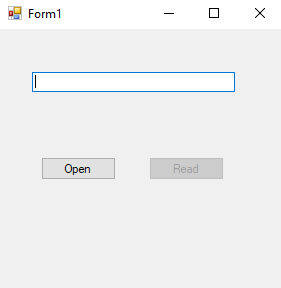
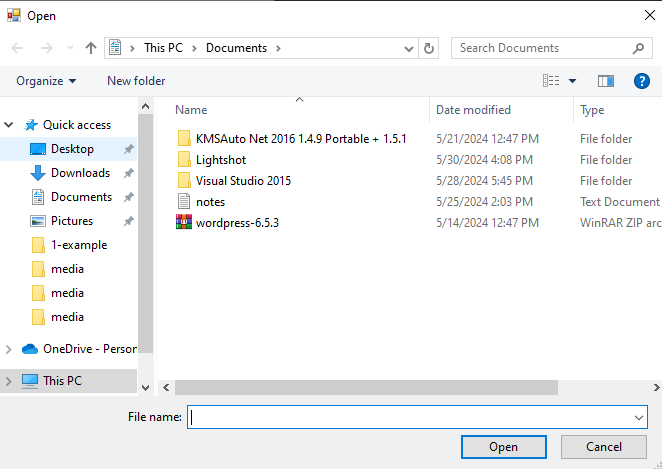
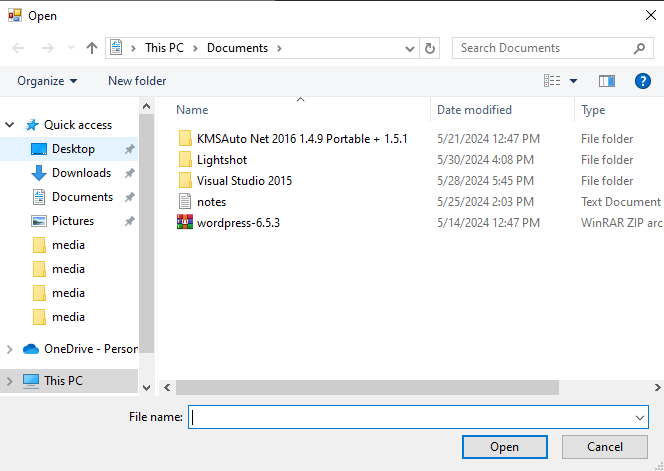
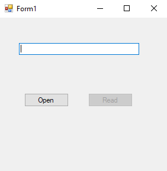
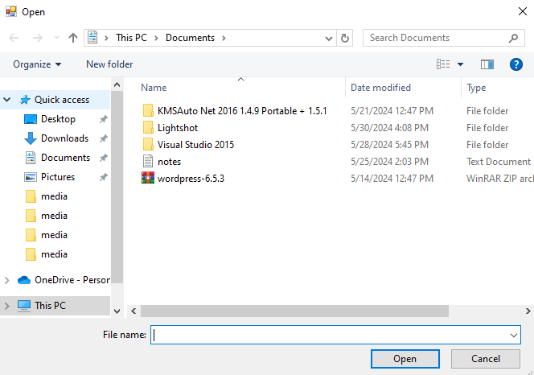
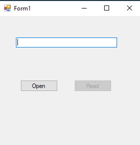
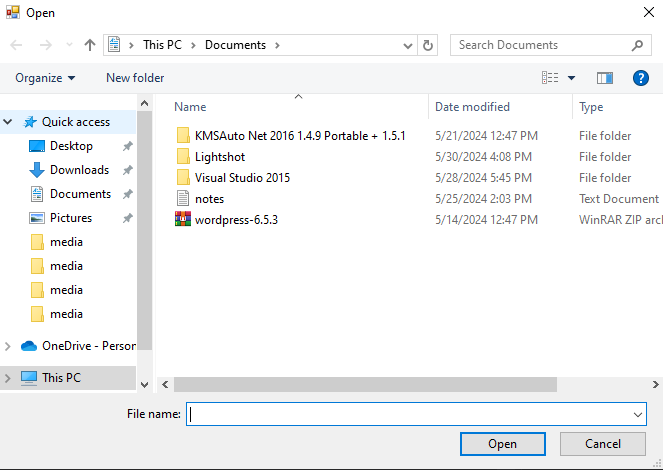

# 36-binary-writter Snippets Code

## 1- example

### Program.cs

```c#
using System;
using System.Collections.Generic;
using System.ComponentModel;
using System.Data;
using System.Drawing;
using System.Linq;
using System.Text;
using System.Threading.Tasks;
using System.Windows.Forms;
using System.IO;

namespace binRead
{
    public partial class Form1 : Form
    {
        public Form1()
        {
            InitializeComponent();
        }

        string path;

        private void button1_Click(object sender, EventArgs e)
        {
            OpenFileDialog ofd=new OpenFileDialog();

            if (ofd.ShowDialog() == DialogResult.OK) {

                path = ofd.FileName;
                button2.Enabled = true;

            }
        }

        private void button2_Click(object sender, EventArgs e)
        {

            BinaryReader br = new BinaryReader(File.OpenRead(path));
            textBox1.Text = br.ReadChar().ToString();
            br.Dispose();
        }
    }
}


```
### Ouput





## 2- example

### Program.cs

```c#
using System;
using System.Collections.Generic;
using System.ComponentModel;
using System.Data;
using System.Drawing;
using System.Linq;
using System.Text;
using System.Threading.Tasks;
using System.Windows.Forms;
using System.IO;

namespace binRead
{
    public partial class Form1 : Form
    {
        public Form1()
        {
            InitializeComponent();
        }

        string path;

        private void button1_Click(object sender, EventArgs e)
        {
            OpenFileDialog ofd=new OpenFileDialog();

            if (ofd.ShowDialog() == DialogResult.OK) {

                path = ofd.FileName;
                button2.Enabled = true;

            }
        }

        private void button2_Click(object sender, EventArgs e)
        {

            BinaryReader br = new BinaryReader(File.OpenRead(path));
            br.BaseStream.Position = 0X2;//position
            textBox1.Text = br.ReadChar().ToString();
            br.Dispose();
        }
    }
}


```
### Ouput




## 3- example

### Program.cs

```c#
using System;
using System.Collections.Generic;
using System.ComponentModel;
using System.Data;
using System.Drawing;
using System.Linq;
using System.Text;
using System.Threading.Tasks;
using System.Windows.Forms;
using System.IO;

namespace binRead
{
    public partial class Form1 : Form
    {
        public Form1()
        {
            InitializeComponent();
        }

        string path;

        private void button1_Click(object sender, EventArgs e)
        {
            OpenFileDialog ofd=new OpenFileDialog();

            if (ofd.ShowDialog() == DialogResult.OK) {

                path = ofd.FileName;
                button2.Enabled = true;

            }
        }

        private void button2_Click(object sender, EventArgs e)
        {

            BinaryReader br = new BinaryReader(File.OpenRead(path));
            br.BaseStream.Position = 0X4;//position
            foreach (char mychar in br.ReadChars(5)) {//read 5 chars

                textBox1.Text += mychar;
            }
            br.Dispose();
        }
    }
}


```
### Ouput




## 4-bit-converter example

### Program.cs

```c#
using System;
using System.Collections.Generic;
using System.ComponentModel;
using System.Data;
using System.Drawing;
using System.Linq;
using System.Text;
using System.Threading.Tasks;
using System.Windows.Forms;
using System.IO;

namespace binRead
{
    public partial class Form1 : Form
    {
        public Form1()
        {
            InitializeComponent();
        }

        string path;

        private void button1_Click(object sender, EventArgs e)
        {
            OpenFileDialog ofd=new OpenFileDialog();

            if (ofd.ShowDialog() == DialogResult.OK) {

                path = ofd.FileName;
                button2.Enabled = true;

            }
        }

        private void button2_Click(object sender, EventArgs e)
        {

            BinaryReader br = new BinaryReader(File.OpenRead(path));
            br.BaseStream.Position = 0X4;//position
            byte[] buffer = br.ReadBytes(4);
            Array.Reverse(buffer);
            textBox1.Text = BitConverter.ToInt32(buffer, 0).ToString("X");
            br.Dispose();
        }
    }
}


```
### Ouput




 
