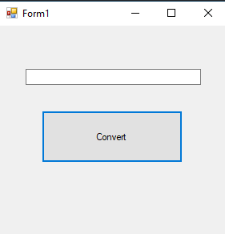
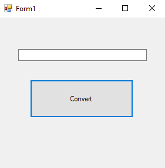
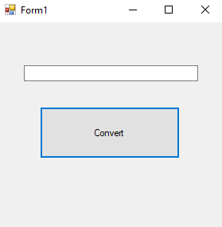
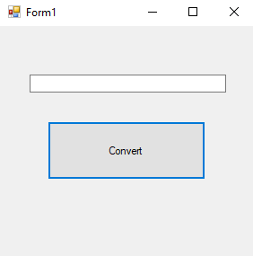
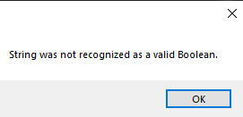

# 39-convert Snippets Code

## 1-int-conversion example

### Program.cs

```c#
using System;
using System.Collections.Generic;
using System.ComponentModel;
using System.Data;
using System.Drawing;
using System.Linq;
using System.Text;
using System.Threading.Tasks;
using System.Windows.Forms;

namespace Convertt
{
    public partial class Form1 : Form
    {
        public Form1()
        {
            InitializeComponent();
        }

        private void button1_Click(object sender, EventArgs e)
        {
           int myInt= Convert.ToInt32(textBox1.Text);//By default textBoxes are string type.We convert the values that we get from the textBox into int32.                                         
           int total = myInt + 5;
            MessageBox.Show(total.ToString());//if we want to print out anything that is in the MSG box we have to convert into the String data type.

        }
    }
}


```
### Ouput




## 2-char-conversion example

### Program.cs

```c#
using System;
using System.Collections.Generic;
using System.ComponentModel;
using System.Data;
using System.Drawing;
using System.Linq;
using System.Text;
using System.Threading.Tasks;
using System.Windows.Forms;

namespace Convertt
{
    public partial class Form1 : Form
    {
        public Form1()
        {
            InitializeComponent();
        }

        private void button1_Click(object sender, EventArgs e)
        {

            char c = Convert.ToChar(textBox1.Text);//We convert the values into char.
            MessageBox.Show(c.ToString());//print it out.

        }
    }
}


```
### Ouput



## 3-boolean-conversion example

### Program.cs

```c#
using System;
using System.Collections.Generic;
using System.ComponentModel;
using System.Data;
using System.Drawing;
using System.Linq;
using System.Text;
using System.Threading.Tasks;
using System.Windows.Forms;

namespace Convertt
{
    public partial class Form1 : Form
    {
        public Form1()
        {
            InitializeComponent();
        }

        private void button1_Click(object sender, EventArgs e)
        {

            bool b = Convert.ToBoolean(textBox1.Text);//convert the values in to boolean.
            MessageBox.Show(b.ToString());

        }
    }
}


```
### Ouput



## 4-exception-error example

### Program.cs

```c#
using System;
using System.Collections.Generic;
using System.ComponentModel;
using System.Data;
using System.Drawing;
using System.Linq;
using System.Text;
using System.Threading.Tasks;
using System.Windows.Forms;

namespace Convertt
{
    public partial class Form1 : Form
    {
        public Form1()
        {
            InitializeComponent();
        }

        private void button1_Click(object sender, EventArgs e)
        {
            try
            {
                bool b = Convert.ToBoolean(textBox1.Text);//convert the values in to boolean.
                MessageBox.Show(b.ToString());
            }
            catch (Exception ea)
            {

                MessageBox.Show(ea.Message);
            }
          

        }
    }
}


```
### Ouput


