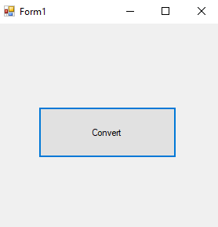

# 40-casting-conversion Snippets Code

## 1- example

### Program.cs

```c#
using System;
using System.Collections.Generic;
using System.ComponentModel;
using System.Data;
using System.Drawing;
using System.Linq;
using System.Text;
using System.Threading.Tasks;
using System.Windows.Forms;

namespace Convertt
{
    public partial class Form1 : Form
    {
        public Form1()
        {
            InitializeComponent();
        }

        private void button1_Click(object sender, EventArgs e)
        {

            object obj = "Adam";//in the object we are able to store any data type.
            if (obj is string) {//if the obj is string

                MessageBox.Show((string)obj);//we converted the obj by using the casting conversion.
            }


        }
    }
}


```

### Ouput




## 2- example

### Program.cs

```c#
using System;
using System.Collections.Generic;
using System.ComponentModel;
using System.Data;
using System.Drawing;
using System.Linq;
using System.Text;
using System.Threading.Tasks;
using System.Windows.Forms;

namespace Convertt
{
    public partial class Form1 : Form
    {
        public Form1()
        {
            InitializeComponent();
        }

        private void button1_Click(object sender, EventArgs e)
        {

            object obj = "guna";
            if (obj is string) {

                string mystr = obj as string;//It is another way to convert.
                MessageBox.Show(mystr);
            }


        }
    }
}


```

### Ouput


