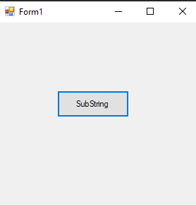
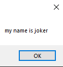

# 45-replace Snippets Code

## Substrin example

### Program.cs

```c#
using System;
using System.Collections.Generic;
using System.ComponentModel;
using System.Data;
using System.Drawing;
using System.Linq;
using System.Text;
using System.Threading.Tasks;
using System.Windows.Forms;

namespace Substrin
{
    public partial class Form1 : Form
    {
        public Form1()
        {
            InitializeComponent();
        }

        private void button1_Click(object sender, EventArgs e)
        {

            string myStr = "my name is guna";
            string myNewStr = myStr.Replace("guna", "joker");//Remove will replace the text.
            MessageBox.Show(myNewStr);


        }
    }
}


```

### Ouput





