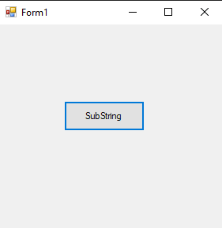
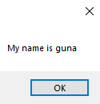

# 46-split Snippets Code

## Substrin example

### Program.cs

```c#

using System;
using System.Collections.Generic;
using System.ComponentModel;
using System.Data;
using System.Drawing;
using System.Linq;
using System.Text;
using System.Threading.Tasks;
using System.Windows.Forms;

namespace Substrin
{
    public partial class Form1 : Form
    {
        public Form1()
        {
            InitializeComponent();
        }

        private void button1_Click(object sender, EventArgs e)
        {


            string names = "guna;joker;hacker;maker;doer";
            string[] nameArr = names.Split(';');//we must use single qoutes.Split will split the strings into array format.1

            foreach (string item in nameArr)
            {

                MessageBox.Show("My name is "+item);

            }


        }
    }
}


```

### Ouput





