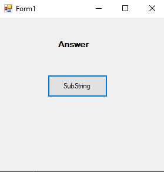
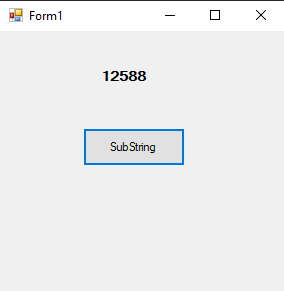
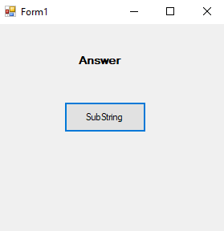
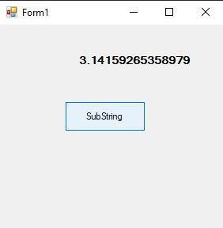
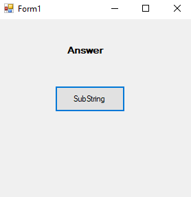
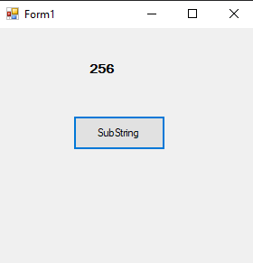
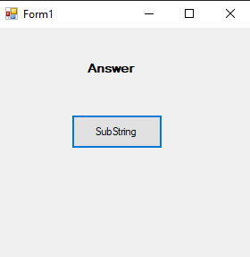
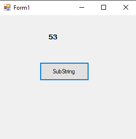

# 48-math Snippets Code

## 1-abs example

### Program.cs

```c#
using System;
using System.Collections.Generic;
using System.ComponentModel;
using System.Data;
using System.Drawing;
using System.Linq;
using System.Text;
using System.Threading.Tasks;
using System.Windows.Forms;

namespace Substrin
{
    public partial class Form1 : Form
    {
        public Form1()
        {
            InitializeComponent();
        }

        private void button1_Click(object sender, EventArgs e)
        {

            label1.Text = Math.Abs(-12588).ToString();
            //Abs is going to return the Abosulate values.
           

        }
    }
}


```

### Ouput




## 2-pi example

### Program.cs

```c#

using System;
using System.Collections.Generic;
using System.ComponentModel;
using System.Data;
using System.Drawing;
using System.Linq;
using System.Text;
using System.Threading.Tasks;
using System.Windows.Forms;

namespace Substrin
{
    public partial class Form1 : Form
    {
        public Form1()
        {
            InitializeComponent();
        }

        private void button1_Click(object sender, EventArgs e)
        {

            label1.Text = Math.PI.ToString();
            //returns PI.
           

        }
    }
}

```

### Ouput




## 3-pow example

### Program.cs

```c#
using System;
using System.Collections.Generic;
using System.ComponentModel;
using System.Data;
using System.Drawing;
using System.Linq;
using System.Text;
using System.Threading.Tasks;
using System.Windows.Forms;

namespace Substrin
{
    public partial class Form1 : Form
    {
        public Form1()
        {
            InitializeComponent();
        }

        private void button1_Click(object sender, EventArgs e)
        {

            label1.Text = Math.Pow(2, 8).ToString();
            //It returns the 2 to the power of 8.
           

        }
    }
}


```

### Ouput




## 4-round example

### Program.cs

```c#
using System;
using System.Collections.Generic;
using System.ComponentModel;
using System.Data;
using System.Drawing;
using System.Linq;
using System.Text;
using System.Threading.Tasks;
using System.Windows.Forms;

namespace Substrin
{
    public partial class Form1 : Form
    {
        public Form1()
        {
            InitializeComponent();
        }

        private void button1_Click(object sender, EventArgs e)
        {

            label1.Text = Math.Round(53.4).ToString();
           //This will Round the number.
           //if it is 53.4 ans is 53
           //if it is 53.5 or more ans is 54.
           

        }
    }
}

```

### Ouput





