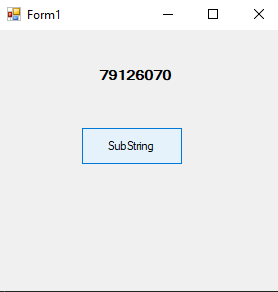
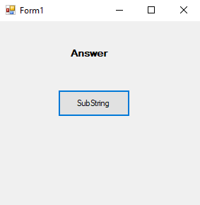
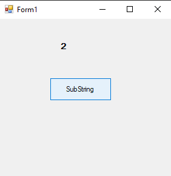
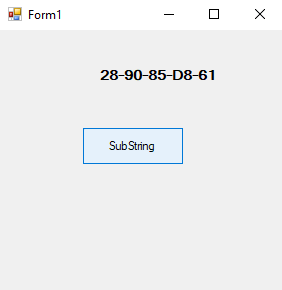
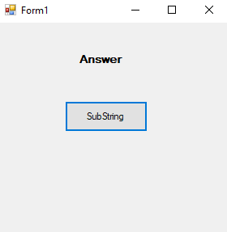
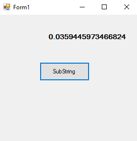

# 49-random-numbers Snippets Code

## 1-next example

### Program.cs

```c#
using System;
using System.Collections.Generic;
using System.ComponentModel;
using System.Data;
using System.Drawing;
using System.Linq;
using System.Text;
using System.Threading.Tasks;
using System.Windows.Forms;

namespace Substrin
{
    public partial class Form1 : Form
    {
        public Form1()
        {
            InitializeComponent();
        }

        private void button1_Click(object sender, EventArgs e)
        {

            Random ra = new Random();
            label1.Text=ra.Next().ToString();
            //It genarates random numbers.

        }
    }
}


```

### Ouput




## 2-next-with-parameters example

### Program.cs

```c#
using System;
using System.Collections.Generic;
using System.ComponentModel;
using System.Data;
using System.Drawing;
using System.Linq;
using System.Text;
using System.Threading.Tasks;
using System.Windows.Forms;

namespace Substrin
{
    public partial class Form1 : Form
    {
        public Form1()
        {
            InitializeComponent();
        }

        private void button1_Click(object sender, EventArgs e)
        {

            Random ra = new Random();
            label1.Text=ra.Next().ToString();
            //It genarates random numbers.

        }
    }
}


```

### Ouput




## 3-random bytes example

### Program.cs

```c#

using System;
using System.Collections.Generic;
using System.ComponentModel;
using System.Data;
using System.Drawing;
using System.Linq;
using System.Text;
using System.Threading.Tasks;
using System.Windows.Forms;

namespace Substrin
{
    public partial class Form1 : Form
    {
        public Form1()
        {
            InitializeComponent();
        }

        private void button1_Click(object sender, EventArgs e)
        {

            Random ra = new Random();
            byte[] raBytes = new byte[5];
            ra.NextBytes(raBytes);
            label1.Text = BitConverter.ToString(raBytes);

        }
    }
}


```

### Ouput




## 4-double example

### Program.cs

```c#
using System;
using System.Collections.Generic;
using System.ComponentModel;
using System.Data;
using System.Drawing;
using System.Linq;
using System.Text;
using System.Threading.Tasks;
using System.Windows.Forms;

namespace Substrin
{
    public partial class Form1 : Form
    {
        public Form1()
        {
            InitializeComponent();
        }

        private void button1_Click(object sender, EventArgs e)
        {

            Random ra = new Random();
            label1.Text = ra.NextDouble().ToString();
            //This will genarate points numbers.

        }
    }
}


```

### Ouput





