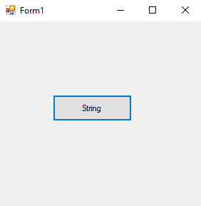
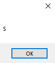
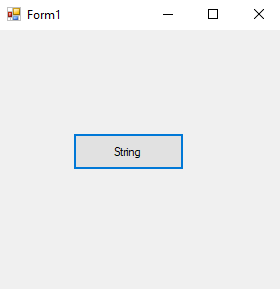
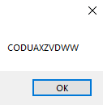

# 50-random-strings Snippets Code

## 1- example

### Program.cs

```c#

using System;
using System.Collections.Generic;
using System.ComponentModel;
using System.Data;
using System.Drawing;
using System.Linq;
using System.Text;
using System.Threading.Tasks;
using System.Windows.Forms;

namespace RandomString
{
    public partial class Form1 : Form
    {
        public Form1()
        {
            InitializeComponent();
        }

        private void button1_Click(object sender, EventArgs e)
        {
            char[] letters = "QWERTUIOPASDFGHJKLZXCVBNM".ToCharArray();
            Random r = new Random();
            MessageBox.Show(letters[r.Next(0, 25)].ToString());

        }
    }
}


```

### Ouput




## 2- example

### Program.cs

```c#
using System;
using System.Collections.Generic;
using System.ComponentModel;
using System.Data;
using System.Drawing;
using System.Linq;
using System.Text;
using System.Threading.Tasks;
using System.Windows.Forms;

namespace RandomString
{
    public partial class Form1 : Form
    {
        public Form1()
        {
            InitializeComponent();
        }

        private void button1_Click(object sender, EventArgs e)
        {
            char[] letters = "QWERTUIOPASDFGHJKLZXCVBNM".ToCharArray();
            Random r = new Random();
            string strs = "";
            for (int a = 0; a <= 10; a++) {

               strs+= letters[r.Next(0, 25)].ToString();
             

            }
            MessageBox.Show(strs);
        }
    }
}
//This will return 10 length random string each time

```

### Ouput





