# 52-directory Snippets Code

## 1-delete example

### Program.cs

```c#
using System;
using System.Collections.Generic;
using System.ComponentModel;
using System.Data;
using System.Drawing;
using System.Linq;
using System.Text;
using System.Threading.Tasks;
using System.Windows.Forms;
using System.IO;


namespace FolderBrowerDia
{
    public partial class Form1 : Form
    {
        public Form1()
        {
            InitializeComponent();
        }

        string destination = "";

        private void button1_Click(object sender, EventArgs e)
        {
            
            FolderBrowserDialog fbd = new FolderBrowserDialog();

            if (fbd.ShowDialog() == DialogResult.OK) {

                //Delete will delete the folder.
                Directory.Delete(fbd.SelectedPath);

            }
            
        }

        private void button2_Click(object sender, EventArgs e)
        {


        }
    }
}


```

### Ouput


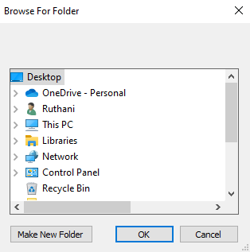

## 2-get-files example

### Program.cs

```c#
using System;
using System.Collections.Generic;
using System.ComponentModel;
using System.Data;
using System.Drawing;
using System.Linq;
using System.Text;
using System.Threading.Tasks;
using System.Windows.Forms;
using System.IO;


namespace FolderBrowerDia
{
    public partial class Form1 : Form
    {
        public Form1()
        {
            InitializeComponent();
        }

        private void button1_Click(object sender, EventArgs e)
        {

            FolderBrowserDialog fbd = new FolderBrowserDialog();

          
            fbd.Description = "Select a path";//Description.

            if (fbd.ShowDialog() == DialogResult.OK)
            {
                //We get all files in the selected path and store in the files array.
                string[] files = Directory.GetFiles(fbd.SelectedPath);

                //Then we loop thorugh all files by using a for loop.
                foreach (string fNames in files) {

                    MessageBox.Show(fNames);
                }

            }

        }
    }
}


```

### Ouput

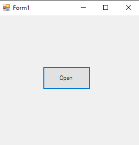
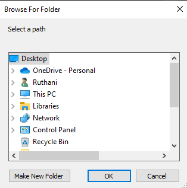

## 3-get-logical-drives example

### Program.cs

```c#
using System;
using System.Collections.Generic;
using System.ComponentModel;
using System.Data;
using System.Drawing;
using System.Linq;
using System.Text;
using System.Threading.Tasks;
using System.Windows.Forms;
using System.IO;


namespace FolderBrowerDia
{
    public partial class Form1 : Form
    {
        public Form1()
        {
            InitializeComponent();
        }

        private void button1_Click(object sender, EventArgs e)
        {
            //The GetLogicalDrives() will get all logigal drives and store in the array.
            string[] logical = Directory.GetLogicalDrives().ToArray();

            for (int u = 0; u <logical.Length; u++)
            {

                MessageBox.Show(logical[u].ToString());

            }
            

        }
    }
}

```

### Ouput

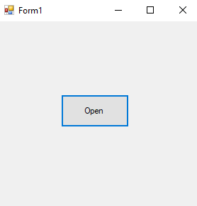
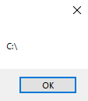


## 4-get-creation-time example

### Program.cs

```c#

using System;
using System.Collections.Generic;
using System.ComponentModel;
using System.Data;
using System.Drawing;
using System.Linq;
using System.Text;
using System.Threading.Tasks;
using System.Windows.Forms;
using System.IO;


namespace FolderBrowerDia
{
    public partial class Form1 : Form
    {
        public Form1()
        {
            InitializeComponent();
        }

        private void button1_Click(object sender, EventArgs e)
        {
            
            FolderBrowserDialog fbd = new FolderBrowserDialog();

            if (fbd.ShowDialog() == DialogResult.OK) {

                //GetCreationTime time return the creation time of the select Folder.
                MessageBox.Show(Directory.GetCreationTime(fbd.SelectedPath).ToString());

            }
            

        }
    }
}

```

### Ouput

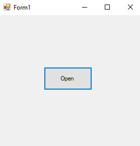


## 5-get-last-access-time example

### Program.cs

```c#
using System;
using System.Collections.Generic;
using System.ComponentModel;
using System.Data;
using System.Drawing;
using System.Linq;
using System.Text;
using System.Threading.Tasks;
using System.Windows.Forms;
using System.IO;


namespace FolderBrowerDia
{
    public partial class Form1 : Form
    {
        public Form1()
        {
            InitializeComponent();
        }

        private void button1_Click(object sender, EventArgs e)
        {
            
            FolderBrowserDialog fbd = new FolderBrowserDialog();

            if (fbd.ShowDialog() == DialogResult.OK) {

                //GetLastAccessTime returns last accessedTime.
                MessageBox.Show(Directory.GetLastAccessTime(fbd.SelectedPath).ToString());

            }
            

        }
    }
}

```

### Ouput

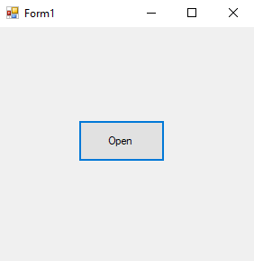
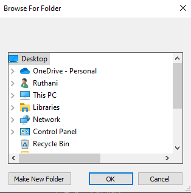


## 6-get-last-write-time example

### Program.cs

```c#
using System;
using System.Collections.Generic;
using System.ComponentModel;
using System.Data;
using System.Drawing;
using System.Linq;
using System.Text;
using System.Threading.Tasks;
using System.Windows.Forms;
using System.IO;


namespace FolderBrowerDia
{
    public partial class Form1 : Form
    {
        public Form1()
        {
            InitializeComponent();
        }

        private void button1_Click(object sender, EventArgs e)
        {
            
            FolderBrowserDialog fbd = new FolderBrowserDialog();

            if (fbd.ShowDialog() == DialogResult.OK) {

                //GetLastWriteTime returns last written time.
                MessageBox.Show(Directory.GetLastWriteTime(fbd.SelectedPath).ToString());

            }
            

        }
    }
}


```

### Ouput

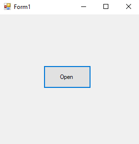
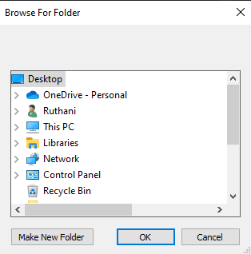


## 7-get-parent example

### Program.cs

```c#
using System;
using System.Collections.Generic;
using System.ComponentModel;
using System.Data;
using System.Drawing;
using System.Linq;
using System.Text;
using System.Threading.Tasks;
using System.Windows.Forms;
using System.IO;


namespace FolderBrowerDia
{
    public partial class Form1 : Form
    {
        public Form1()
        {
            InitializeComponent();
        }

        private void button1_Click(object sender, EventArgs e)
        {
            
            FolderBrowserDialog fbd = new FolderBrowserDialog();

            if (fbd.ShowDialog() == DialogResult.OK) {

                //GetParent returns the parant folder.
                MessageBox.Show(Directory.GetParent(fbd.SelectedPath).ToString());

            }
            

        }
    }
}


```

### Ouput

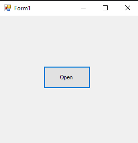
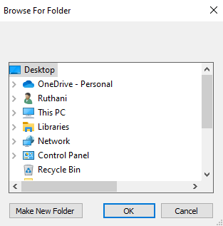


## 8-create-directory example

### Program.cs

```c#

using System;
using System.Collections.Generic;
using System.ComponentModel;
using System.Data;
using System.Drawing;
using System.Linq;
using System.Text;
using System.Threading.Tasks;
using System.Windows.Forms;
using System.IO;


namespace FolderBrowerDia
{
    public partial class Form1 : Form
    {
        public Form1()
        {
            InitializeComponent();
        }

        private void button1_Click(object sender, EventArgs e)
        {
            
            FolderBrowserDialog fbd = new FolderBrowserDialog();

            if (fbd.ShowDialog() == DialogResult.OK) {

                //CreateDirectory will create in the selected path with name of maker.
                Directory.CreateDirectory(fbd.SelectedPath + "\\maker");

            }
            

        }
    }
}


```

### Ouput

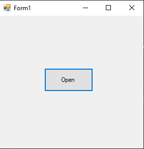
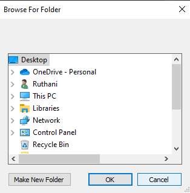


## 9-create-directory-advanced example

### Program.cs

```c#

using System;
using System.Collections.Generic;
using System.ComponentModel;
using System.Data;
using System.Drawing;
using System.Linq;
using System.Text;
using System.Threading.Tasks;
using System.Windows.Forms;
using System.IO;


namespace FolderBrowerDia
{
    public partial class Form1 : Form
    {
        public Form1()
        {
            InitializeComponent();
        }

        private void button1_Click(object sender, EventArgs e)
        {
            
            FolderBrowserDialog fbd = new FolderBrowserDialog();

            if (fbd.ShowDialog() == DialogResult.OK) {

                //CreateDirectory will create in the selected path with name of textBox1 given.
                Directory.CreateDirectory(fbd.SelectedPath + "\\"+textBox1.Text);

            }
            

        }
    }
}

```

### Ouput

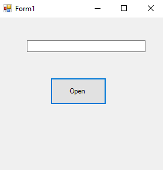
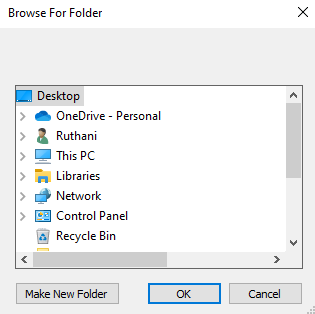


## 10-move example

### Program.cs

```c#
using System;
using System.Collections.Generic;
using System.ComponentModel;
using System.Data;
using System.Drawing;
using System.Linq;
using System.Text;
using System.Threading.Tasks;
using System.Windows.Forms;
using System.IO;


namespace FolderBrowerDia
{
    public partial class Form1 : Form
    {
        public Form1()
        {
            InitializeComponent();
        }

        private void button1_Click(object sender, EventArgs e)
        {
            
            FolderBrowserDialog fbd = new FolderBrowserDialog();

            if (fbd.ShowDialog() == DialogResult.OK) {

                //Move will move the selected folder with the name of gta.
                Directory.Move(fbd.SelectedPath, "C:\\gta");

            }
            

        }
    }
}


```

### Ouput

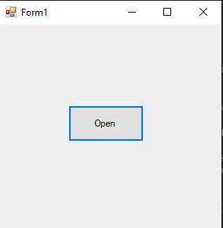
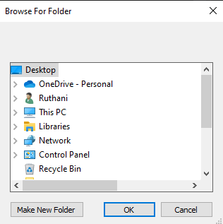
