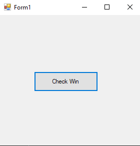
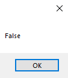
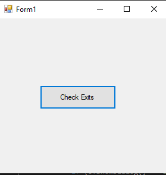
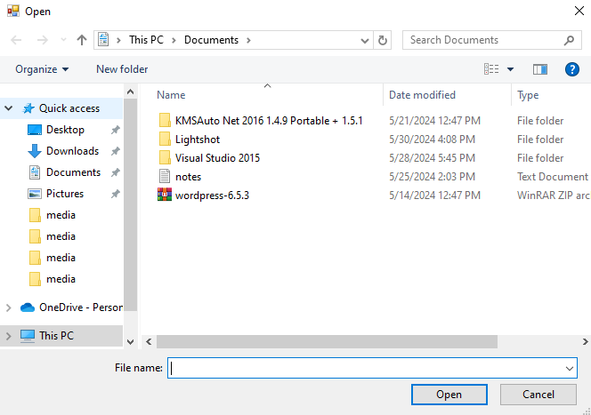
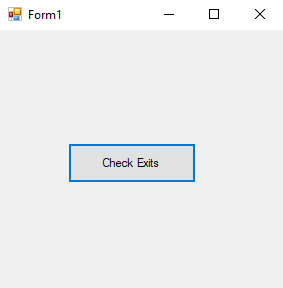
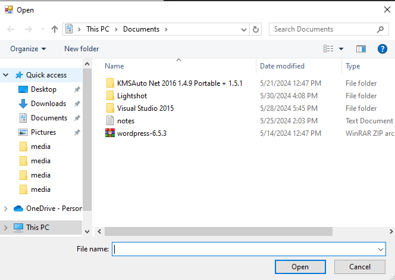

# 53-file Snippets Code

## 1-exists example

### Program.cs

```c#

using System;
using System.Collections.Generic;
using System.ComponentModel;
using System.Data;
using System.Drawing;
using System.Linq;
using System.Text;
using System.Threading.Tasks;
using System.Windows.Forms;
using System.IO;
namespace file
{
    public partial class Form1 : Form
    {
        public Form1()
        {
            InitializeComponent();
        }

        private void button1_Click(object sender, EventArgs e)
        {

            MessageBox.Show(File.Exists("C:\\sdk.cf").ToString());

            //Exits checks weather a specified file exits or not.
            //It returns true if it is exits otherwise false.

        }
    }
}

```

### Ouput





## 2-delete example

### Program.cs

```c#
using System;
using System.Collections.Generic;
using System.ComponentModel;
using System.Data;
using System.Drawing;
using System.Linq;
using System.Text;
using System.Threading.Tasks;
using System.Windows.Forms;
using System.IO;
namespace file
{
    public partial class Form1 : Form
    {
        public Form1()
        {
            InitializeComponent();
        }

        private void button1_Click(object sender, EventArgs e)
        {

            OpenFileDialog o = new OpenFileDialog();

            if (o.ShowDialog() == DialogResult.OK) {

                File.Delete(o.FileName);

            }

            //File.Delete Will remove the file.
        }
    }
}

```

### Ouput





## 3-copy example

### Program.cs

```c#
using System;
using System.Collections.Generic;
using System.ComponentModel;
using System.Data;
using System.Drawing;
using System.Linq;
using System.Text;
using System.Threading.Tasks;
using System.Windows.Forms;
using System.IO;
namespace file
{
    public partial class Form1 : Form
    {
        public Form1()
        {
            InitializeComponent();
        }

        private void button1_Click(object sender, EventArgs e)
        {

            OpenFileDialog o = new OpenFileDialog();

            if (o.ShowDialog() == DialogResult.OK) {

                File.Copy(o.FileName, "D:\\kuna.txt");

            }

            //The Copy will copy the file.
        }
    }
}

```

### Ouput





