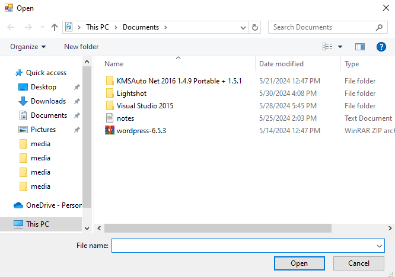
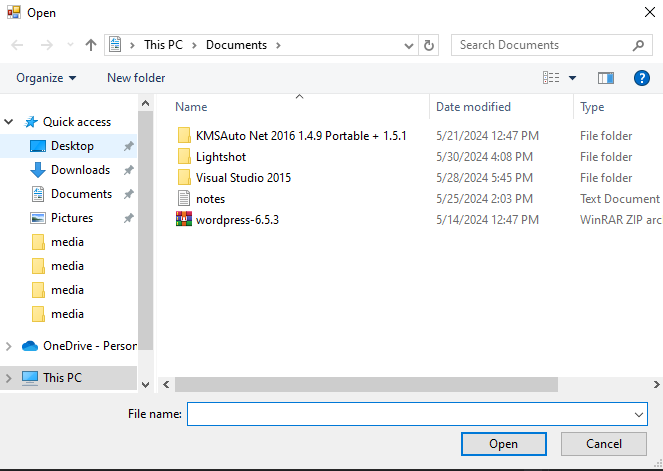
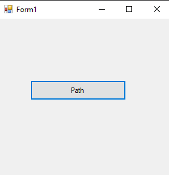
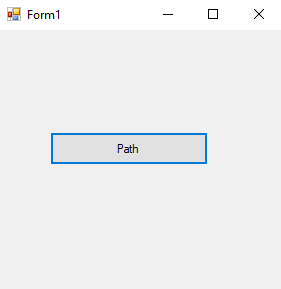
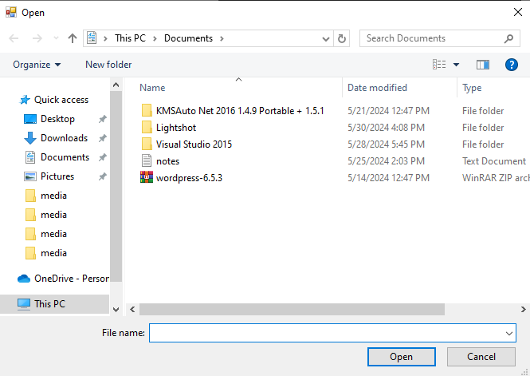
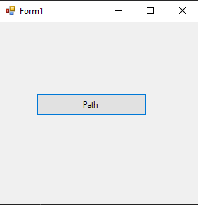
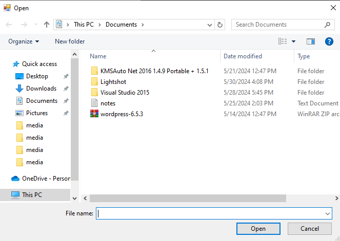

# 54-path Snippets Code

## 1-get-directory-name example

### Program.cs

```c#
using System;
using System.Collections.Generic;
using System.ComponentModel;
using System.Data;
using System.Drawing;
using System.Linq;
using System.Text;
using System.Threading.Tasks;
using System.Windows.Forms;
using System.IO;

namespace path
{
    public partial class Form1 : Form
    {
        public Form1()
        {
            InitializeComponent();
        }

        private void button1_Click(object sender, EventArgs e)
        {

            OpenFileDialog o = new OpenFileDialog();

            if (o.ShowDialog() == DialogResult.OK) {

               MessageBox.Show(Path.GetDirectoryName(o.FileName));

                //GetDirectoryName returns the path without the file name

            }

        }
    }
}


```

### Ouput





## 2-get-extension example

### Program.cs

```c#
using System;
using System.Collections.Generic;
using System.ComponentModel;
using System.Data;
using System.Drawing;
using System.Linq;
using System.Text;
using System.Threading.Tasks;
using System.Windows.Forms;
using System.IO;

namespace path
{
    public partial class Form1 : Form
    {
        public Form1()
        {
            InitializeComponent();
        }

        private void button1_Click(object sender, EventArgs e)
        {

            OpenFileDialog o = new OpenFileDialog();

            if (o.ShowDialog() == DialogResult.OK) {

               MessageBox.Show(Path.GetExtension(o.FileName));

                //GetExtension returns the Extension of the selected element.


            }

        }
    }
}

```

### Ouput





## 3-get-file-name example

### Program.cs

```c#

using System;
using System.Collections.Generic;
using System.ComponentModel;
using System.Data;
using System.Drawing;
using System.Linq;
using System.Text;
using System.Threading.Tasks;
using System.Windows.Forms;
using System.IO;

namespace path
{
    public partial class Form1 : Form
    {
        public Form1()
        {
            InitializeComponent();
        }

        private void button1_Click(object sender, EventArgs e)
        {

            OpenFileDialog o = new OpenFileDialog();

            if (o.ShowDialog() == DialogResult.OK) {

               MessageBox.Show(Path.GetFileName(o.FileName));

                //GetFileName returns the file name with extension


            }

        }
    }
}

```

### Ouput


## 4-get-file-name-without-extension example

### Program.cs

```c#

using System;
using System.Collections.Generic;
using System.ComponentModel;
using System.Data;
using System.Drawing;
using System.Linq;
using System.Text;
using System.Threading.Tasks;
using System.Windows.Forms;
using System.IO;

namespace path
{
    public partial class Form1 : Form
    {
        public Form1()
        {
            InitializeComponent();
        }

        private void button1_Click(object sender, EventArgs e)
        {

            OpenFileDialog o = new OpenFileDialog();

            if (o.ShowDialog() == DialogResult.OK) {

               MessageBox.Show(Path.GetFileNameWithoutExtension(o.FileName));

                //GetFileNameWithoutExtension returns the file name without extension


            }

        }
    }
}


```

### Ouput




## 5-get-full-path example

### Program.cs

```c#
using System;
using System.Collections.Generic;
using System.ComponentModel;
using System.Data;
using System.Drawing;
using System.Linq;
using System.Text;
using System.Threading.Tasks;
using System.Windows.Forms;
using System.IO;

namespace path
{
    public partial class Form1 : Form
    {
        public Form1()
        {
            InitializeComponent();
        }

        private void button1_Click(object sender, EventArgs e)
        {

            OpenFileDialog o = new OpenFileDialog();

            if (o.ShowDialog() == DialogResult.OK) {

               MessageBox.Show(Path.GetFullPath(o.FileName));

                //GetFullPath returns the full path.


            }

        }
    }
}


```

### Ouput


## 6-get-full-path-other-method example

### Program.cs

```c#
using System;
using System.Collections.Generic;
using System.ComponentModel;
using System.Data;
using System.Drawing;
using System.Linq;
using System.Text;
using System.Threading.Tasks;
using System.Windows.Forms;
using System.IO;

namespace path
{
    public partial class Form1 : Form
    {
        public Form1()
        {
            InitializeComponent();
        }

        private void button1_Click(object sender, EventArgs e)
        {

            OpenFileDialog o = new OpenFileDialog();

            if (o.ShowDialog() == DialogResult.OK) {

               MessageBox.Show(o.FileName);

                //This is also same as GetFullPath


            }

        }
    }
}


```

### Ouput




## 7-has-extension example

### Program.cs

```c#

using System;
using System.Collections.Generic;
using System.ComponentModel;
using System.Data;
using System.Drawing;
using System.Linq;
using System.Text;
using System.Threading.Tasks;
using System.Windows.Forms;
using System.IO;

namespace path
{
    public partial class Form1 : Form
    {
        public Form1()
        {
            InitializeComponent();
        }

        private void button1_Click(object sender, EventArgs e)
        {

            OpenFileDialog o = new OpenFileDialog();

            if (o.ShowDialog() == DialogResult.OK) {

               MessageBox.Show(Path.HasExtension(o.FileName).ToString());

                //This returns true if the selected file has extension otherwise false.


            }

        }
    }
}

```

### Ouput


