# 55-process Snippets Code

## 1-start example

### Program.cs

```c#

using System;
using System.Collections.Generic;
using System.ComponentModel;
using System.Data;
using System.Drawing;
using System.Linq;
using System.Text;
using System.Threading.Tasks;
using System.Windows.Forms;
using System.Diagnostics;


namespace pro
{
    public partial class Form1 : Form
    {
        public Form1()
        {
            InitializeComponent();
        }

        private void button1_Click(object sender, EventArgs e)
        {

            OpenFileDialog open = new OpenFileDialog();

            if (open.ShowDialog() == DialogResult.OK) {

                Process.Start(open.FileName);

            }

        }
    }
}


//we should use using System.Diagnostics;
//Process start can open files

```

### Ouput

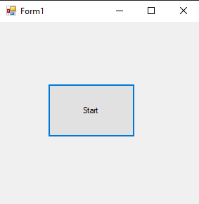
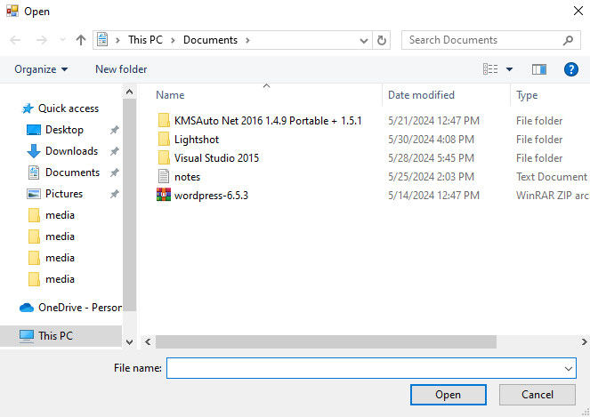


## 2-start-notepad example

### Program.cs

```c#
using System;
using System.Collections.Generic;
using System.ComponentModel;
using System.Data;
using System.Drawing;
using System.Linq;
using System.Text;
using System.Threading.Tasks;
using System.Windows.Forms;
using System.Diagnostics;


namespace pro
{
    public partial class Form1 : Form
    {
        public Form1()
        {
            InitializeComponent();
        }

        private void button1_Click(object sender, EventArgs e)
        {

            Process.Start("Notepad.exe");
            //we can also start cmd.exe and more.

        }
    }
}


//we should use using System.Diagnostics;
//Process start can open files


```

### Ouput

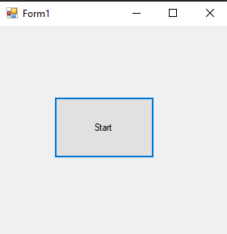
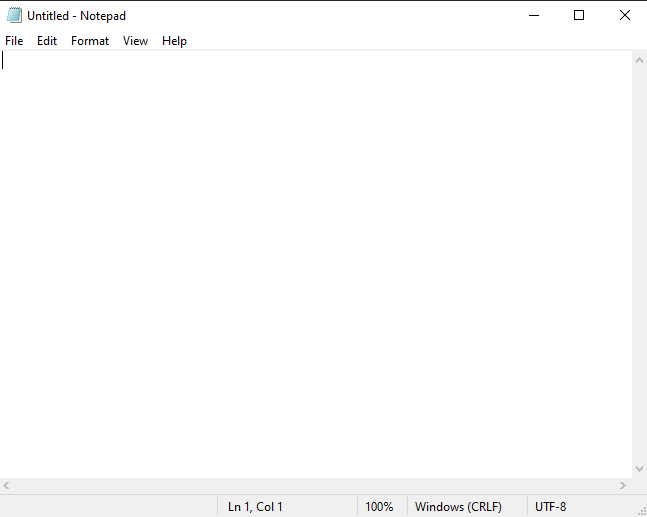


## 3-get-current-process example

### Program.cs

```c#
using System;
using System.Collections.Generic;
using System.ComponentModel;
using System.Data;
using System.Drawing;
using System.Linq;
using System.Text;
using System.Threading.Tasks;
using System.Windows.Forms;
using System.Diagnostics;


namespace pro
{
    public partial class Form1 : Form
    {
        public Form1()
        {
            InitializeComponent();
        }

        private void button1_Click(object sender, EventArgs e)
        {

            MessageBox.Show(Process.GetCurrentProcess().ProcessName.ToString());
            //This will return the current process file name means this process.

        }
    }
}


```

### Ouput

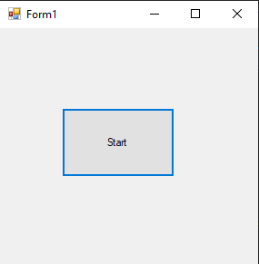
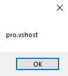


## 4-get-current-process-kill example

### Program.cs

```c#

using System;
using System.Collections.Generic;
using System.ComponentModel;
using System.Data;
using System.Drawing;
using System.Linq;
using System.Text;
using System.Threading.Tasks;
using System.Windows.Forms;
using System.Diagnostics;


namespace pro
{
    public partial class Form1 : Form
    {
        public Form1()
        {
            InitializeComponent();
        }

        private void button1_Click(object sender, EventArgs e)
        {


            Process.GetCurrentProcess().Kill();
            //This will kill the current process.

        }
    }
}


```

### Ouput

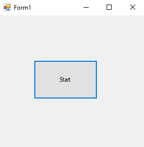


## 5-get-all-process example

### Program.cs

```c#
using System;
using System.Collections.Generic;
using System.ComponentModel;
using System.Data;
using System.Drawing;
using System.Linq;
using System.Text;
using System.Threading.Tasks;
using System.Windows.Forms;
using System.Diagnostics;


namespace pro
{
    public partial class Form1 : Form
    {
        public Form1()
        {
            InitializeComponent();
        }

        private void button1_Click(object sender, EventArgs e)
        {

            foreach (Process p in Process.GetProcesses()) {

                MessageBox.Show(p.ProcessName);

            }

            //This will returns all the processes.
          
        }
    }
}


```

### Ouput

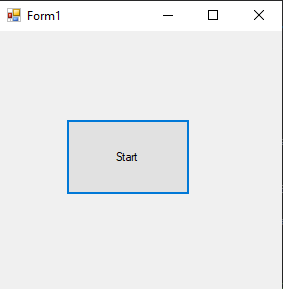


## 6-responding example

### Program.cs

```c#
using System;
using System.Collections.Generic;
using System.ComponentModel;
using System.Data;
using System.Drawing;
using System.Linq;
using System.Text;
using System.Threading.Tasks;
using System.Windows.Forms;
using System.Diagnostics;


namespace pro
{
    public partial class Form1 : Form
    {
        public Form1()
        {
            InitializeComponent();
        }

        private void button1_Click(object sender, EventArgs e)
        {

            foreach (Process p in Process.GetProcesses()) {

                MessageBox.Show(p.Responding.ToString());

            }

            //This returns true if one process is responding
          
        }
    }
}


```

### Ouput

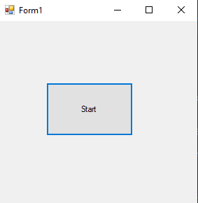
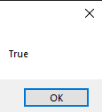

## 7-kill example

### Program.cs

```c#

using System;
using System.Collections.Generic;
using System.ComponentModel;
using System.Data;
using System.Drawing;
using System.Linq;
using System.Text;
using System.Threading.Tasks;
using System.Windows.Forms;
using System.Diagnostics;


namespace pro
{
    public partial class Form1 : Form
    {
        public Form1()
        {
            InitializeComponent();
        }

        private void button1_Click(object sender, EventArgs e)
        {

            foreach (Process p in Process.GetProcesses()) {

                MessageBox.Show(p.ProcessName.ToString());

                if (p.ProcessName == "vlc") {

                    p.Kill();
                }

            }

            //if vlc in process kill it.
          
        }
    }
}


```

### Ouput

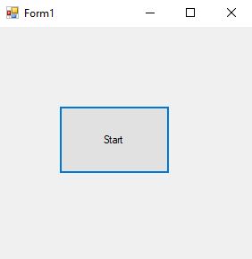
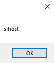

## 8-kill-non-responding-process example

### Program.cs

```c#

using System;
using System.Collections.Generic;
using System.ComponentModel;
using System.Data;
using System.Drawing;
using System.Linq;
using System.Text;
using System.Threading.Tasks;
using System.Windows.Forms;
using System.Diagnostics;


namespace pro
{
    public partial class Form1 : Form
    {
        public Form1()
        {
            InitializeComponent();
        }

        private void button1_Click(object sender, EventArgs e)
        {

            foreach (Process p in Process.GetProcesses()) {

                if (!p.Responding) {

                    p.Kill();
                }

                //Kill all process which are not responding.

            }
            
        }
    }
}


```

### Ouput

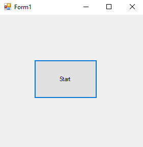


## 9-get-processes-by-name-kill example

### Program.cs

```c#
using System;
using System.Collections.Generic;
using System.ComponentModel;
using System.Data;
using System.Drawing;
using System.Linq;
using System.Text;
using System.Threading.Tasks;
using System.Windows.Forms;
using System.Diagnostics;


namespace pro
{
    public partial class Form1 : Form
    {
        public Form1()
        {
            InitializeComponent();
        }

        private void button1_Click(object sender, EventArgs e)
        {

            foreach (Process p in Process.GetProcessesByName("vlc")) {

                p.Kill();
            }
            
        }
    }
}


```

### Ouput


