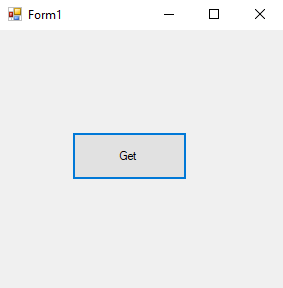
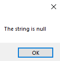
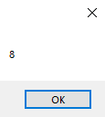

# 56-null-coalesce-operator Snippets Code

## 1- example

### Program.cs

```c#
using System;
using System.Collections.Generic;
using System.ComponentModel;
using System.Data;
using System.Drawing;
using System.Linq;
using System.Text;
using System.Threading.Tasks;
using System.Windows.Forms;

namespace strnull
{
    public partial class Form1 : Form
    {
        public Form1()
        {
            InitializeComponent();
        }

        private void button1_Click(object sender, EventArgs e)
        {

            string myStr = null;

            MessageBox.Show(myStr ?? "The string is null");

        }
    }
}

```

### Ouput




## 2- example

### Program.cs

```c#
using System;
using System.Collections.Generic;
using System.ComponentModel;
using System.Data;
using System.Drawing;
using System.Linq;
using System.Text;
using System.Threading.Tasks;
using System.Windows.Forms;

namespace strnull
{
    public partial class Form1 : Form
    {
        public Form1()
        {
            InitializeComponent();
        }

        private void button1_Click(object sender, EventArgs e)
        {


            int? i = null; //if we want to store null value we should type int?.
            int x =i ?? 8;
            MessageBox.Show(x.ToString());

            //if i is null print the value that is in the x;
            //if it's not this will print the i value.


        }
    }
}


```

### Ouput





