# 57-bitwise-operator Snippets Code

## 1-not example

### Program.cs

```c#
using System;
using System.Collections.Generic;
using System.ComponentModel;
using System.Data;
using System.Drawing;
using System.Linq;
using System.Text;
using System.Threading.Tasks;
using System.Windows.Forms;

namespace Bitwse
{
    public partial class Form1 : Form
    {
        public Form1()
        {
            InitializeComponent();
        }

        private void button1_Click(object sender, EventArgs e)
        {

            short myShort = ~3;//Invert Not opearator.
            MessageBox.Show(Convert.ToString(myShort, 2));//2 means converts into binary.

            //3 == 011==100
           //By default it will add 14 zeros before the answer
           //The 14 zeros will be 1 because it is not operator.
           //11 will be zero.

            
        }
    }
}


```

### Ouput

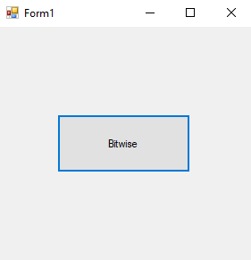
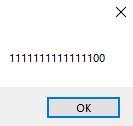


## 2-and example

### Program.cs

```c#
using System;
using System.Collections.Generic;
using System.ComponentModel;
using System.Data;
using System.Drawing;
using System.Linq;
using System.Text;
using System.Threading.Tasks;
using System.Windows.Forms;

namespace Bitwse
{
    public partial class Form1 : Form
    {
        public Form1()
        {
            InitializeComponent();
        }

        private void button1_Click(object sender, EventArgs e)
        {


            short myShort = 3 & 4;//011 & 101 ==001
            MessageBox.Show(Convert.ToString(myShort,2));//2 means binary.
            
           

        }
    }
}


```

### Ouput

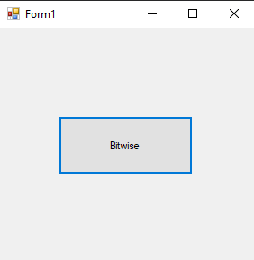
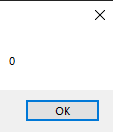


## 3-or example

### Program.cs

```c#

using System;
using System.Collections.Generic;
using System.ComponentModel;
using System.Data;
using System.Drawing;
using System.Linq;
using System.Text;
using System.Threading.Tasks;
using System.Windows.Forms;

namespace Bitwse
{
    public partial class Form1 : Form
    {
        public Form1()
        {
            InitializeComponent();
        }

        private void button1_Click(object sender, EventArgs e)
        {


            short myShort = 3 | 4;//011 | 100 ==111
            MessageBox.Show(Convert.ToString(myShort,2));//2 means binary.
            
           

        }
    }
}


```

### Ouput

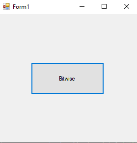
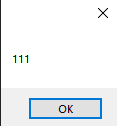


## 4-xor example

### Program.cs

```c#
using System;
using System.Collections.Generic;
using System.ComponentModel;
using System.Data;
using System.Drawing;
using System.Linq;
using System.Text;
using System.Threading.Tasks;
using System.Windows.Forms;

namespace Bitwse
{
    public partial class Form1 : Form
    {
        public Form1()
        {
            InitializeComponent();
        }

        private void button1_Click(object sender, EventArgs e)
        {


            short myShort = 3 ^ 5;//011 ^ 101 == 110
            MessageBox.Show(Convert.ToString(myShort,2));//2 means binary.
            //This is XOR 
            //If both are same false otherwise true.
           

        }
    }
}


```

### Ouput

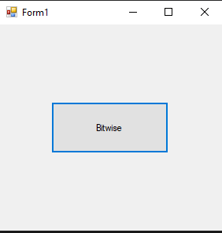
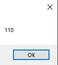


## 5-right-shift example

### Program.cs

```c#

using System;
using System.Collections.Generic;
using System.ComponentModel;
using System.Data;
using System.Drawing;
using System.Linq;
using System.Text;
using System.Threading.Tasks;
using System.Windows.Forms;

namespace Bitwse
{
    public partial class Form1 : Form
    {
        public Form1()
        {
            InitializeComponent();
        }

        private void button1_Click(object sender, EventArgs e)
        {


            short myShort = 5 >> 1;//101 >> 1 == 10
            MessageBox.Show(Convert.ToString(myShort,2));//2 means binary.
    
           //Right Shift

        }
    }
}


```

### Ouput

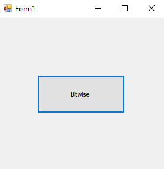
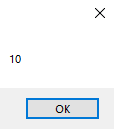


## 6-left-shift example

### Program.cs

```c#
using System;
using System.Collections.Generic;
using System.ComponentModel;
using System.Data;
using System.Drawing;
using System.Linq;
using System.Text;
using System.Threading.Tasks;
using System.Windows.Forms;

namespace Bitwse
{
    public partial class Form1 : Form
    {
        public Form1()
        {
            InitializeComponent();
        }

        private void button1_Click(object sender, EventArgs e)
        {


            short myShort = 15 << 1;//1111 << 1 == 11110
            MessageBox.Show(Convert.ToString(myShort,2));//2 means binary.
    
           //Right Shift

        }
    }
}


```

### Ouput

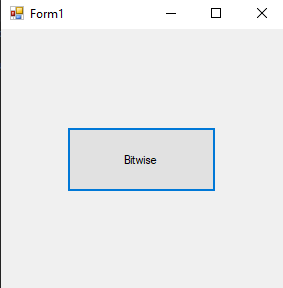
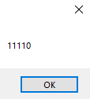

## 7-left-shift-2 example

### Program.cs

```c#

using System;
using System.Collections.Generic;
using System.ComponentModel;
using System.Data;
using System.Drawing;
using System.Linq;
using System.Text;
using System.Threading.Tasks;
using System.Windows.Forms;

namespace Bitwse
{
    public partial class Form1 : Form
    {
        public Form1()
        {
            InitializeComponent();
        }

        private void button1_Click(object sender, EventArgs e)
        {


            short myShort = 15 << 3;//1111 << 1 == 1111000
            MessageBox.Show(Convert.ToString(myShort,2));//2 means binary.
    
           //Right Shift

        }
    }
}


```

### Ouput

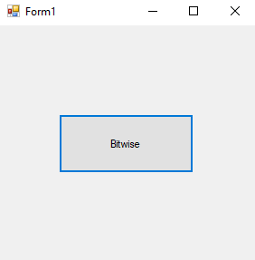
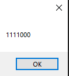