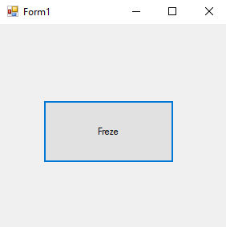
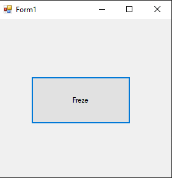
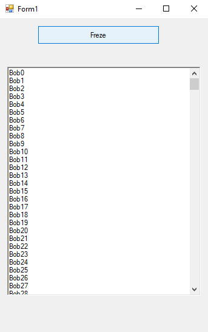
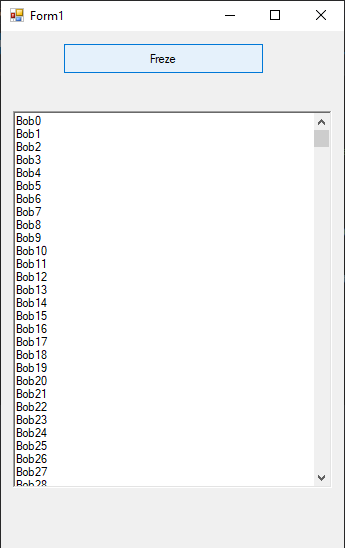

# 58-threading Snippets Code

## 1-freeze example

### Program.cs

```c#
using System;
using System.Collections.Generic;
using System.ComponentModel;
using System.Data;
using System.Drawing;
using System.Linq;
using System.Text;
using System.Threading.Tasks;
using System.Windows.Forms;

namespace Thierding
{
    public partial class Form1 : Form
    {
        public Form1()
        {
            InitializeComponent();
        }

        private void button1_Click(object sender, EventArgs e)
        {

            start();

        }

        void start() {

            for (;;) ;

        }
    }
}

//This program will be frezse.
//If we run this code in a threading that section will only frezse.

```

### Ouput




## 2-simple-threading example

### Program.cs

```c#
using System;
using System.Collections.Generic;
using System.ComponentModel;
using System.Data;
using System.Drawing;
using System.Linq;
using System.Text;
using System.Threading.Tasks;
using System.Windows.Forms;
using System.Threading;


namespace Thierding
{
    public partial class Form1 : Form
    {
        public Form1()
        {
            InitializeComponent();
        }

        Thread t;

        private void button1_Click(object sender, EventArgs e)
        {

            t = new Thread(frezse);
            t.Start();
            

        }

        void frezse() {

            for (;;) ;

        }
    }
}

//using System.Threading;

```

### Ouput




## 4-threading-arguments-pass example

### Program.cs

```c#

using System;
using System.Collections.Generic;
using System.ComponentModel;
using System.Data;
using System.Drawing;
using System.Linq;
using System.Text;
using System.Threading.Tasks;
using System.Windows.Forms;
using System.Threading;


namespace Thierding
{
    public partial class Form1 : Form
    {
        public Form1()
        {
            InitializeComponent();
        }

        Thread t;
        string mystr = "";

        private void button1_Click(object sender, EventArgs e)
        {

            t = new Thread(write);
            object[] ObjA = { "Bob", 500 };
            t.Start(ObjA);
            while (t.IsAlive) {//when the thread is working do nothing.

                ;
            }

            richTextBox1.Text = mystr; ;


        }


        //We can only pass Object if we use theard.
        void write(object arr) {

            object[] o = arr as object[];

            for (int i = 0; i < Convert.ToInt32(o[1]); i++)
            {

                mystr += o[0].ToString()+ i.ToString() + "\r\n";


            }

        }
    }
}

//using System.Threading;
```

### Ouput




## 5-threading-time example

### Program.cs

```c#
using System;
using System.Collections.Generic;
using System.ComponentModel;
using System.Data;
using System.Drawing;
using System.Linq;
using System.Text;
using System.Threading.Tasks;
using System.Windows.Forms;
using System.Threading;


namespace Thierding
{
    public partial class Form1 : Form
    {
        public Form1()
        {
            InitializeComponent();
        }

        Thread t;
        string mystr = "";

        private void button1_Click(object sender, EventArgs e)
        {

            t = new Thread(write);
            object[] ObjA = { "Bob", 500 };
            t.Start(ObjA);
            while (t.IsAlive) {//when the thread is working do nothing.

                ;
            }

            richTextBox1.Text = mystr; ;


        }


        //We can only pass Object if we use theard.
        void write(object arr) {

            object[] o = arr as object[];

            for (int i = 0; i < Convert.ToInt32(o[1]); i++)
            {
                Thread.Sleep(10);//It will wait 10 milliSecound.
                mystr += o[0].ToString()+ i.ToString() + "\r\n";


            }

        }
    }
}

//using System.Threading;
```

### Ouput




