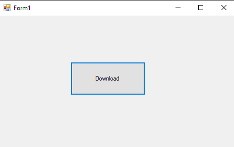
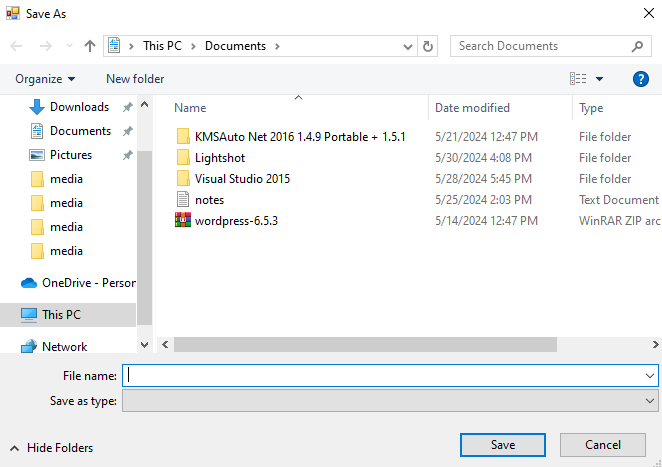

# 59-web-client Snippets Code

## 1-download-string example

### Program.cs

```c#

using System;
using System.Collections.Generic;
using System.ComponentModel;
using System.Data;
using System.Drawing;
using System.Linq;
using System.Text;
using System.Threading.Tasks;
using System.Windows.Forms;
using System.Net;

namespace webCLient
{
    public partial class Form1 : Form
    {
        public Form1()
        {
            InitializeComponent();
        }

        private void richTextBox1_TextChanged(object sender, EventArgs e)
        {

        }

        private void Form1_Load(object sender, EventArgs e)
        {
            WebClient w = new WebClient();
            richTextBox1.Text = w.DownloadString("http://localhost/Java.txt");
            //This text is get from this above link.

        }
    }
}

//using System.Net;

```

### Ouput


## 2-download-file-async example

### Program.cs

```c#

using System;
using System.Collections.Generic;
using System.ComponentModel;
using System.Data;
using System.Drawing;
using System.Linq;
using System.Text;
using System.Threading.Tasks;
using System.Windows.Forms;
using System.Net;

namespace webCLient
{
    public partial class Form1 : Form
    {
        public Form1()
        {
            InitializeComponent();
        }

        private void button1_Click(object sender, EventArgs e)
        {
            SaveFileDialog sfd = new SaveFileDialog();

            if (sfd.ShowDialog() == DialogResult.OK)
            {

                WebClient w = new WebClient();

                w.DownloadFileAsync(new Uri("http://localhost/Java.txt"), sfd.FileName);
                //sfd.FileName is the place where we want to store the file.
                w.DownloadFileCompleted += W_DownloadFileCompleted;
                w.DownloadProgressChanged += W_DownloadProgressChanged;

            }
        }

        private void W_DownloadProgressChanged(object sender, DownloadProgressChangedEventArgs e)
        {
            label1.Text = "Prograss " + e.ProgressPercentage;
        }

        private void W_DownloadFileCompleted(object sender, AsyncCompletedEventArgs e)
        {
            MessageBox.Show("File has been downloaded");
        }


        private void richTextBox1_TextChanged(object sender, EventArgs e)
        {

        }

        private void Form1_Load(object sender, EventArgs e)
        {
           
           
        }

      
        
    }
}

//using System.Net;

```

### Ouput





