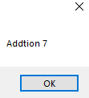

# 6-mathamatical Snippets Code

## swSta Example

### Program.cs

```c#
using System;
using System.Collections.Generic;
using System.ComponentModel;
using System.Data;
using System.Drawing;
using System.Linq;
using System.Text;
using System.Threading.Tasks;
using System.Windows.Forms;

namespace swSta
{
    public partial class Form1 : Form
    {
        public Form1()
        {
            InitializeComponent();
        }

        private void button1_Click(object sender, EventArgs e)
        {


            int a = 5;
            int b = 2;

            MessageBox.Show("Addtion "+(a+b));//+ addition
            MessageBox.Show("Subtraction "+(a-b));//- subtraction
            MessageBox.Show("Multiply "+(a*b));//multiplay.
            MessageBox.Show("Division "+(a/b));//Division.
            MessageBox.Show("Moduls "+(a%b));//Modules

            a++;//increment.
            b--;//decrement.
            //++a;
            //--a;

            MessageBox.Show("The value of a is "+a);
            MessageBox.Show("The value of b is "+b);

            


        }
    }
}

```

### Ouput





      


